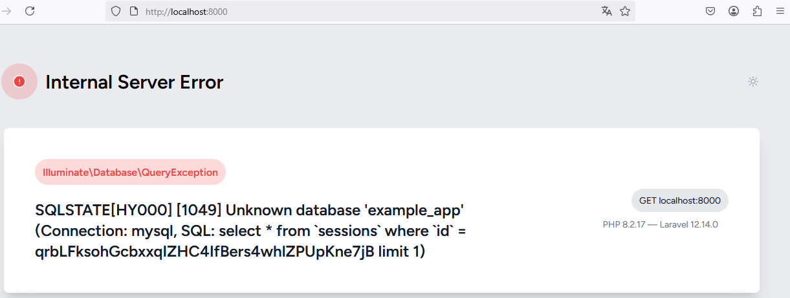
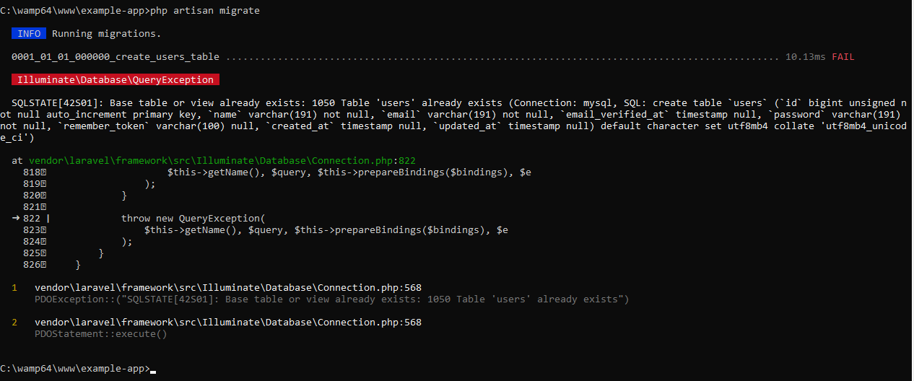
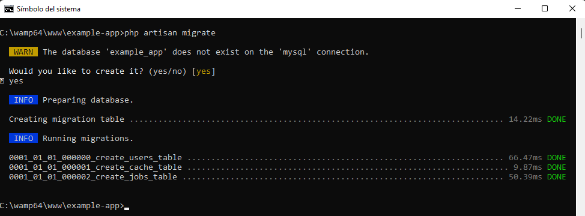
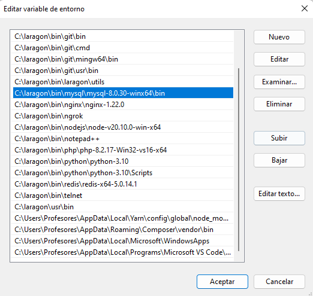
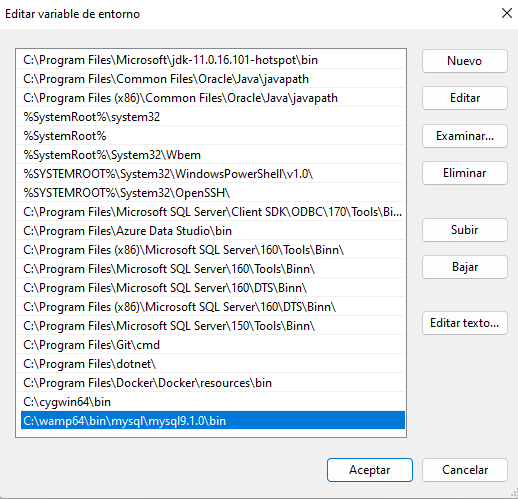
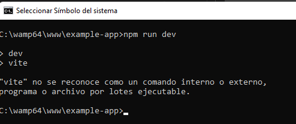
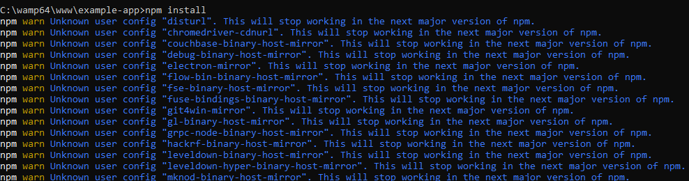
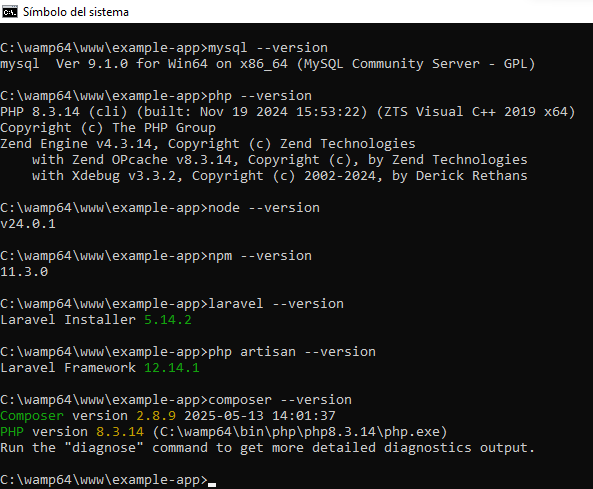
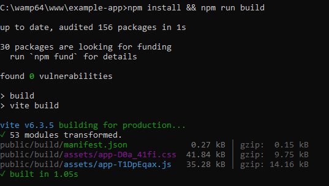

# CREAR UN PROYECTO EN LARAVEL 12
- MySQL
- PHP
- Composer
- NodeJS & npm

## Requisitos

1. **WAMPServer** o paquete equivalente. Lo que realmente se necesita es tener instalado MySQL y el módulo de PHP. Las versiones pueden variar pero se recomienda que sea `MySQL 8.0` o superior y `PHP 8.2` o superior.
2. **Composer** instalado. A la hora de instalar composer se pide elegir la versión de PHP compatible con Laravel 12. Yo seleccioné `php-8.2.17`. Composer es un gestor de dependencias de PHP.

## Paso 1. Instalar laravel/installer

```
composer global require laravel/installer
```

## Paso 2. Crear una nueva aplicación

Para crear una nueva aplicaciones tiene varias alternativas. A continuación se muestran algunas formas posibles:

```
laravel new example-app
```

```
composer create-project laravel/laravel example-app
```

```
composer create-project --prefer-dist laravel/laravel example-app "12.*"
```

Responder a las preguntas. Normalmente dejamos las opciones predeterminadas, por lo tanto, solo presionamos ENTER; pero es bueno que lea y cambie sus respuestas si es conveniente.

Este proceso lo he realizado en equipos diferentes y no siempre es igual (me refiero a las preguntas que hace el asistente). Sin duda, esto se debe al hecho de que tengo diferentes versiones o herramientas configuradas en los equipos.

```
 Which starter kit would you like to install? [None]:
  [none    ] None
  [react   ] React
  [vue     ] Vue
  [livewire] Livewire
 >

Which authentication provider do you prefer? [Laravel's built-in authentication]:
  [laravel] Laravel's built-in authentication
  [workos ] WorkOS (Requires WorkOS account)

Which testing framework do you prefer? [Pest]:
  [0] Pest
  [1] PHPUnit

 Would you like to run npm install and npm run build? (yes/no) [yes]:
 >no
```

## Paso 3. Ingresar a la carpeta del proyecto y ejecutarlo.

Ingrese al directorio del proyecto con el comando `cd example-app`

La documentación oficial de Laravel indica que debemos ejecutar los siguientes comandos:

```
npm install && npm run build
composer run dev
```

Nota. Debido a que yo no tengo instalado NodeJS no me han funcionado los comandos `npm install && npm run build` ni `composer run dev`. Después de instalar **NodeJS** sí funcionarán los comandos anteriores; pero para probar que el proyecto funciona no son necesarios por el momento.

## Paso 4. Probar el proyecto

```
php artisan serve

```

Nota. Se puede acceder al sitio web desde el navegador web. `http://localhost:8000`

Debido a que no he configurado la base de datos se muestra el siguiente error: 

 

Antes de continuar, detenga la aplicación con `Control + C` 

## Paso 5. Descargar e instalar Visual Studio Code.

- Descargue Visual Studio Code.
- Instale Visual Studio Code.
- Abra la carpeta `example-app` en Visual Studio Code.

## Paso 6. Configuraciones de base de datos.

Estas configuracionese se realizan en el archivo  `example-app\.env`

```sql
DB_CONNECTION=sqlite
# DB_HOST=127.0.0.1
# DB_PORT=3306
# DB_DATABASE=laravel
# DB_USERNAME=root
# DB_PASSWORD=
```

Las configuraciones quedarán como se muestra en el siguiente ejemplo:  

```sql
DB_CONNECTION=mysql
DB_HOST=127.0.0.1
DB_PORT=3306
DB_DATABASE=example_app
DB_USERNAME=root
DB_PASSWORD=
```

## Paso 7. Ejecutar las migraciones.
Ahora que ya indicó qué gestor de base de datos utilizará y el nombre de la base de datos que quiere crear, ejecute las migraciones.  
`php artisan migrate`

Como la base de datos aún no existe, le hará la siguiente pregunta (responda yes): 

```
WARN  The database 'example_app' does not exist on the 'mysql' connection.
Would you like to create it? (yes/no) [yes]
```

:collision: Yo tuve problemas a la hora de ejecutar las migraciones. Las siguientes imágenes muestran una evidencia de ello.  

  

  

Al parecer, los errores se deben a la longitud predeterminada de las cadenas en el proyecto de Laravel 12.  

**SOLUCIÓN**

- Abrir el archivo `app/Providers/AppServiceProvider.php`
- En la parte superior del archivo debe hacer la siguiente importación:  `use Illuminate\Support\Facades\Schema;` 
- En el archivo `AppServiceProvider.php` tiene una función llamada `boot()` y debe modificarla como sigue:  
    ```public function boot(): void
    {
        Schema::defaultStringLength(191);
    }
    ```
- Ejecutar nuevamente las migraciones `php artisan migrate` 

      

**:eyes: COMENTARIOS (lectura opcional)**
---
A pesar de la solución expuesta, al ejecutar el procedimiento en otra computadora encontré lo siguiente:

- La computadora tiene instaladas varias versiones de MySQL.
- En `Laragon`  tengo :open_file_folder: mysql-8.0.30-winx64 y :open_file_folder: mysql-8.4.3-winx64.
- En wamp64 tengo :open_file_folder: mysql9.1.0. 
    
- La consola `CMD` reconoce la versión de `MySQL 8.0.30`. Esto lo puedo verificar con el comando `mysql --version`.
- Entiendo que se ejecutó la migración utilizando el ejecutable `C:\laragon\bin\mysql\mysql-8.0.30-winx64\bin` cuando el servicio de `MySQL` en ejecución corresponde al alojado en `C:\wamp64\bin\mysql\mysql9.1.0\bin`.  
- El error se genera por la configuración de la variable `PATH` de Windows.
- Para solucionar el problema, agregué la ruta `C:\wamp64\bin\mysql\mysql9.1.0\bin` a la variable `PATH` de Windows.  
- Borré la base de datos `drop database example_app`
- Volví a ejecutar las migraciones `php artisan migrate`.
- También comento que los servicios de `Laragon` estaban detenidos. 
- Quizá mucha explicación; pero a futuro estos comentarios pueden ser de utilidad. 

    **Nivel de usuario:** 

      

    **Nivel de sistema:**  

      

    NOTA. Lo ideal sería utilizar una misma versión de MySQL.  Además, basta con tener la ruta de MySQL a nivel de usuario o a nivel de sistema; pero mi configuración está tal cual lo expliqué.  
---

## Paso 8. Descargar e instalar NodeJS

**¿Por qué es necesario ejecutar los siguientes comandos?**   
Obserque en la siguiente imagen. No se puede ejecutar npm run dev.  



Después de descargar e instalar NodeJS, ejecuté nuevamente las instrucciones del **Paso 3** y ahora sí funcionaron.

```
npm install && npm run build
composer run dev
```

OTRA EXPERIENCIA. En otra computadora.  
En otro equipo tenía `node v20.10.0` y no me funcionaron los comandos.
La versión de `node` la puede averiguar con el comando `node --version`. En este equipo instalé la versión `v24.0.1` de `node`.   

Error a la hora de tratar de instalar `npm` 

  

Similar como me ocurrió con MySQL, tengo problemas con las diferentes versiones de nodejs, npm, php, composer. Entonces, me aseguré de configurar correctamente la variable PATH para que la cosonla `CMD` trabaje con las versiones actualizadas.

  


Encontré un archivo llamado `.npmrc` en el directorio :file_folder: `c:\users\macv\`. El archivo tenía el contenido que presento abajo. Borré el contenido, guardé y ahora sí funcionó el comando. Sin embargo, creo que lo que hace es alertarme de componentes que a futuro ya no estarán disponibles.
<details>
<summary>.npmrc</summary>
registry=https://registry.npm.taobao.org/
disturl=https://npm.taobao.org/dist
chromedriver-cdnurl=https://npm.taobao.org/mirrors/chromedriver
couchbase-binary-host-mirror=https://npm.taobao.org/mirrors/couchbase/v{version}
debug-binary-host-mirror=https://npm.taobao.org/mirrors/node-inspector
electron-mirror=https://npm.taobao.org/mirrors/electron/
flow-bin-binary-host-mirror=https://npm.taobao.org/mirrors/flow/v
fse-binary-host-mirror=https://npm.taobao.org/mirrors/fsevents
fuse-bindings-binary-host-mirror=https://npm.taobao.org/mirrors/fuse-bindings/v{version}
git4win-mirror=https://npm.taobao.org/mirrors/git-for-windows
gl-binary-host-mirror=https://npm.taobao.org/mirrors/gl/v{version}
grpc-node-binary-host-mirror=https://npm.taobao.org/mirrors
hackrf-binary-host-mirror=https://npm.taobao.org/mirrors/hackrf/v{version}
leveldown-binary-host-mirror=https://npm.taobao.org/mirrors/leveldown/v{version}
leveldown-hyper-binary-host-mirror=https://npm.taobao.org/mirrors/leveldown-hyper/v{version}
mknod-binary-host-mirror=https://npm.taobao.org/mirrors/mknod/v{version}
node-sqlite3-binary-host-mirror=https://npm.taobao.org/mirrors
node-tk5-binary-host-mirror=https://npm.taobao.org/mirrors/node-tk5/v{version}
nodegit-binary-host-mirror=https://npm.taobao.org/mirrors/nodegit/v{version}/
operadriver-cdnurl=https://npm.taobao.org/mirrors/operadriver
phantomjs-cdnurl=https://npm.taobao.org/mirrors/phantomjs
profiler-binary-host-mirror=https://npm.taobao.org/mirrors/node-inspector/
puppeteer-download-host=https://npm.taobao.org/mirrors
python-mirror=https://npm.taobao.org/mirrors/python
rabin-binary-host-mirror=https://npm.taobao.org/mirrors/rabin/v{version}
sass-binary-site=https://npm.taobao.org/mirrors/node-sass
sodium-prebuilt-binary-host-mirror=https://npm.taobao.org/mirrors/sodium-prebuilt/v{version}
sqlite3-binary-site=https://npm.taobao.org/mirrors/sqlite3
utf-8-validate-binary-host-mirror=https://npm.taobao.org/mirrors/utf-8-validate/v{version}
utp-native-binary-host-mirror=https://npm.taobao.org/mirrors/utp-native/v{version}
zmq-prebuilt-binary-host-mirror=https://npm.taobao.org/mirrors/zmq-prebuilt/v{version}
strict-ssl=true
</details>

Ahora sí funcionó `npm install`  o `npm install && npm run build` 

Solo instalar las dependencias:  

  

Instalar las dependencias y ejecutar a la vez:  

  

Pienso que ejecutar `npm run build` no es necesario en este momento; pero así está en el ejemplo.  

**Primera prueba**  

Consola 1: 
```
npm run dev
```
Consola 2: 
```
php artisan serve
```

En navegador web:  

Visite: http://localhost:8000

  

# Referencias

https://laravel.com/
