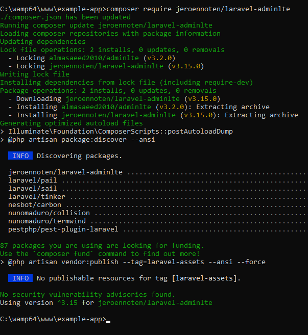
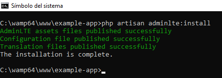
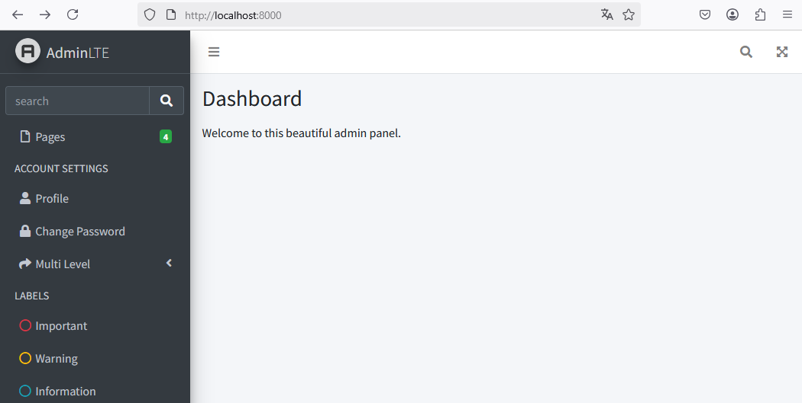
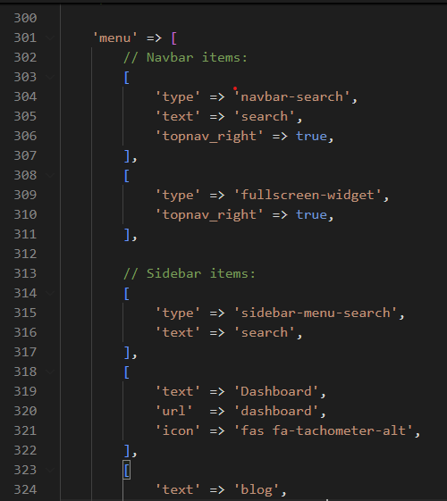
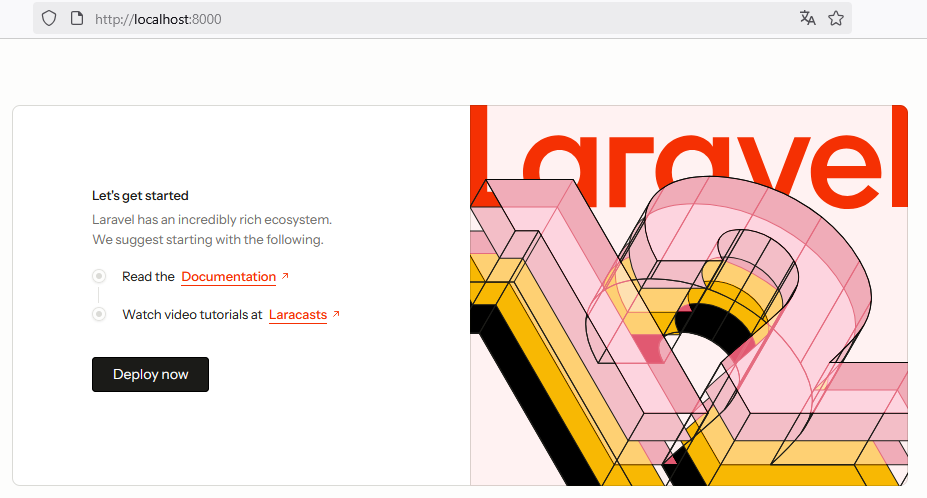

# INSTALACIÓN Y CONFIGURACIÓN DE ADMINLTE

Nota. Verifique que se encuentra en :file_folder: `example_app` 

## Paso 1. Configure el paquete jeroennoten/laravel-adminlte

`composer require jeroennoten/laravel-adminlte`

  

## Paso 2. Publique los assets de AdminLTE en su proyecto.

`php artisan adminlte:install`  

  


## Paso 3. Pruebe AdminLTE

* En `routes/web.php` se tiene la ruta `/` que retorna la vista `welmecome` 
```php
    <?php
    use Illuminate\Support\Facades\Route;

    Route::get('/', function () {
        return view('welcome');
    });
  ```
* Esto indica que cuando ejecuta la aplicación se muestra el contenido del archivo `resources/views/wellcome.blade.php`. 
* Saque una copia del archivo `resources/views/welcome.blade.php` y deje la copia en el mismo directorio. Tendrá dos archivos: a) `welcome.blade.php` y b) `welcome.blade copy.php`  
* Vamos a modificar el archivo original (`welcome.blade.php`) para que use la plantilla AdminLTE.

Puede consultar la siguiente URL para obtener las instrucciones que debe pegar en el archivo **wellcome.blade.php**:  
`https://jeroennoten.github.io/Laravel-AdminLTE/sections/overview/usage.html`

pero si no quiere consultar la URL, este es contenido que puede utilizar:  

```php
@extends('adminlte::page')

@section('title', 'Dashboard')

@section('content_header')
    <h1>Dashboard</h1>
@stop

@section('content')
    <p>Welcome to this beautiful admin panel.</p>
@stop

@section('css')
    {{-- Add here extra stylesheets --}}
    {{-- <link rel="stylesheet" href="/css/admin_custom.css"> --}}
@stop

@section('js')
    <script> console.log("Hi, I'm using the Laravel-AdminLTE package!"); </script>
@stop
```

En dos consolas ejecute los comandos para ejecutar la aplicación: 

Consola 1:  
```
npm run dev
```

Consola 2:  
```
php artisan serve
```

Acceda a `http://localhost:8000`  y vea el resultado de AdminLTE.  

  

:orange_book: Ahora que ya probó la plantilla AdminLTE, sustituya el contenido de `welcome.blade.php` por el contenido que tenía originalmente. El contenido original lo puede encontrar en `welcome.blade copy.php`. Luego, :x: borre la copia.  

**¿Por qué dejamos el archivo como estaba inicialmente?**

Esto lo hicimos solamente para probar que la plantilla AdminLTE está funcionando; pero la plantilla será aplicada en el **Dashboard** que se creará más adelante.  

## Paso 12. Agregar una opción en el menú.

Para agregar una opción en el menú lateral de la plantilla AdminLTE puede editar el archivo `config/adminlte.php`

Por ejemplo, para crear un enlace que permita acceder al `dashboard` (que será creado cuando se configure laravel/breeze), puede agregar la siguiente configuración:  

```Javascript
'menu' => [
    [
        'text' => 'Dashboard',
        'url'  => 'dashboard',
        'icon' => 'fas fa-tachometer-alt',
    ],
    // Add more menu items here
],
```

  

:bulb: Las líneas que se agregaron son de 318 a 322 en la imagen anterior.

Nota. No le pido que vuelva a ejecutar la aplicación porque la opción de menú no tendrá ningún efecto en este momento. Y por otro lado, la aplicación se mostraría como el inicio, porque la pueba de la plantilla AdminLTE fue borrada.

Siempre se vería así:  

  

Sin embargo, ya probamos que la plantilla está funcionando.

# Referencias


## AdminLTE

https://kritimyantra.com/blogs/laravel-12-adminlte-integration-setup-your-stunning-admin-dashboard

## AdminLTE - Oficial

https://jeroennoten.github.io/Laravel-AdminLTE/
