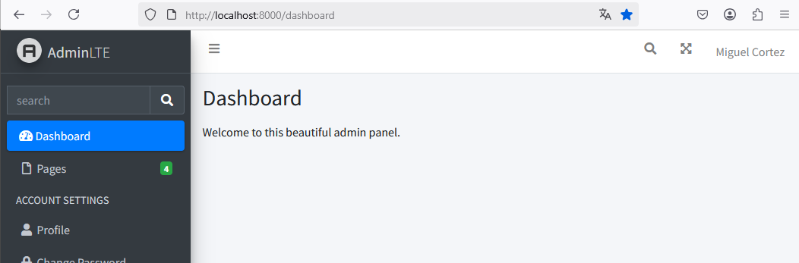

# LARAVEL/BREEZE

Laravel/Breeze permite gestionar la creación de cuentas de usuario, el acceso y las configuraciones del perfil de usuario.  

## Paso 1. Configure el paquete laravel/breeze

`composer require laravel/breeze`

  

## Paso 2. Instale el paquete.

```
php artisan breeze:install
```

  

Nota. Durante el asistente de instalación pregunta qué herramienta utilizará para hacer pruebas. Yo seleccioné `PHPUnit` quizá no lo utilicemos.  

## Paso 3. Ejecutar comandos.

```
npm install
npm run dev
```

Nota. Recuerde que **npm install** instala las dependencias necesarias.  

## Paso 4. Ejecutar las migraciones

```
php artisan migrate
```

:bulb: **Nota**. En mi caso, cuando ejecuté las migraciones en este punto no encontró nada que migrar.  Mensaje ` INFO  Nothing to migrate.` 

## Paso 5. Probar la aplicación.

```
php artisan serve
```

Acceda a `http://localhost:800`  

  

## Paso 6. Modificar la vista dashboard.blade.php

Con la instalación y configuración de `laravel/breeze` se creó una nueva vista llamada `resources/views/dashboard.blade.php`. 

Vamos a cambiar el contenido de esta vista para que use la plantilla de AdminLTE como lo hicimos anteriormente con `resources/views/welcome.blade.php`.

:bulb: No necesariamente debe sacar una copia del arhivo `resources/views/dashboard.blade.php` antes de modificarlo (solamente es necesario en caso de cometer algún error y si quiere restaurar el contenido original de la vista).  

Este es el contenido que debe tener el archivo `dashboard.blade.php`: 

```php
@extends('adminlte::page')

@section('title', 'Dashboard')

@section('content_header')
    <h1>Dashboard</h1>
@stop

@section('content')
    <p>Welcome to this beautiful admin panel.</p>
@stop

@section('css')
    {{-- Add here extra stylesheets --}}
    {{-- <link rel="stylesheet" href="/css/admin_custom.css"> --}}
@stop

@section('js')
    <script> console.log("Hi, I'm using the Laravel-AdminLTE package!"); </script>
@stop
```

## Paso 7. Probar nuevamente la aplicación.

a) Ejecute la aplicación con `npm run dev` y `php artisan serve`.    
b) Ingrese a `http://localhost:8000`.  
c) Ingrese al botón `Register` y cree un nuevo usuario.  Inmediatamente después de crear el usuario será redirigido/a al dashboard de la aplicación.    
d) Compruebe que la aplicación luce como la siguiente imagen.  

  

# Referencias

* https://codecourse.com/articles/how-to-install-laravel-breeze-on-laravel-12

* https://kritimyantra.com/blogs/install-laravel-breeze-package-in-laravel-12

