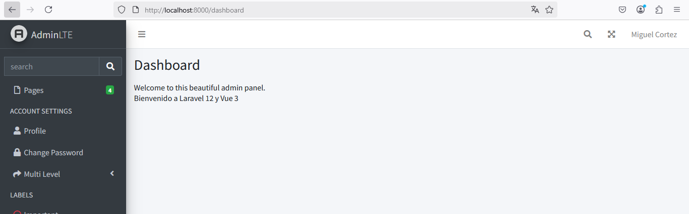

# CONFIGURAR VUE

## Paso 1. Instalar vue y las dependencias adicionales.

```
npm install vue@latest vue-router@latest @vitejs/plugin-vue
```

   
## Paso 2. Configurar vite para que funcione con vue.
Las configuraciones se realizarán en `vite.config.js` 

Configuraciones originales:  

```javascript
import { defineConfig } from 'vite';
import laravel from 'laravel-vite-plugin';

export default defineConfig({
    plugins: [
        laravel({
            input: ['resources/css/app.css', 'resources/js/app.js'],
            refresh: true,
        }),
    ],
});
```
Configuraciones modificadas:  

```javascript
import { defineConfig } from 'vite';
import vue from '@vitejs/plugin-vue';
import laravel from 'laravel-vite-plugin';

export default defineConfig({
    plugins: [
        laravel({
            input: ['resources/js/app.js'],
            refresh: true,
        }),
        vue(),
    ],
});
```

Se agregaron las siguientes líneas:  

a) `import vue from '@vitejs/plugin-vue';`  
b) `vue(),`  

## Paso 3. Crear un punto de entrada para la aplicación Vue.

:bulb: Nota. Es común crear un archivo llamado `app.js` con las configuraciones de la aplicación `vue`; pero en mi caso, ya tengo un archivo con ese nombre y por esa razón le llamaré `appVue.js`  

El archivo será creado en :file_folder: ` resources\js`

El contenido del archivo será el siguiente:  

```javascript
import { createApp } from 'vue';
import App from './components/App.vue';
createApp(App).mount('#app');
```
:speech_balloon: Si ha seguido la primera guía, yo había creado un archivo llamado **AppComponent.vue**; pero finalmente decidí llamarle **App.vue** que es lo más habitual.  
## Paso 4. Crear un componente de vue

Antes de crear el primer componente, vamos a crear una carpeta llamada `components` en el directorio `resources\js` 

Después de creada la carpeta, agregue un nuevo archivo llamado `App.vue` dentro del directorio `resources\js\components`  

El contenido del archivo `App.vue` será el siguiente: 

```javascript
<template>
    <div>
        <h1>Bienvenido a Laravel 12 y Vue 3</h1>
    </div>
</template>
```

## Paso 5. Configurar la aplicación Vue.

Para que se ejecute la aplicación Vue debemos hacer dos cosas:  
1. Cargar el archivo `appVue.js` con @vite(...). Normalmente esto se hace en el archivo `resources/views/layouts.app.blade.php`, pero debido a que tengo configurado AdminLTE trataré de hacerlo en otro lugar que más adelante explicaré.
2. Crear un div donde será cargada la aplicación Vue. En este ejemplo el div se creará así `<div id="app"></div>` 

### Cargar el script appVue.js
Vamos a agregar una línea en `vendor\jeroennoten\laravel-adminlte\resources\views\master.blade.php`.  

Localice la línea `</head>` y justo arriba coloque la instrucción `@vite(['resources/css/app.css', 'resources/js/app.js', 'resources/js/appVue.js'])`

### Crear un div para mostrar los resultados
Con lo anterior ya se ejecutará la aplicación de Vue, pero falta definir dónde se mostrará su contenido.

Vaya al archivo `resources\views\dashboard.blade.php` y agregue la línea `<div id="app"></div>` como se ve en el siguiente código:  

```php
@extends('adminlte::page')

@section('title', 'Dashboard')

@section('content_header')
    <h1>Dashboard</h1>
@stop

@section('content')
    <p>Welcome to this beautiful admin panel.</p>
    <div id="app"></div>
@stop

@section('css')
    {{-- Add here extra stylesheets --}}
    {{-- <link rel="stylesheet" href="/css/admin_custom.css"> --}}
@stop

@section('js')
    <script> console.log("Hi, I'm using the Laravel-AdminLTE package!"); </script>
@stop
```

### Configuración típica (omita este paso)
<details>
<summary>Si no estuviera utilizando la plantilla AdminLTE, las configuraciones serían estas</summary>  

La actualización se hará en el archivo `resources/views/layouts/app.blade.php` 

Contenido original: 

```php
<!DOCTYPE html>
<html lang="{{ str_replace('_', '-', app()->getLocale()) }}">
    <head>
        <meta charset="utf-8">
        <meta name="viewport" content="width=device-width, initial-scale=1">
        <meta name="csrf-token" content="{{ csrf_token() }}">

        <title>{{ config('app.name', 'Laravel') }}</title>

        <!-- Fonts -->
        <link rel="preconnect" href="https://fonts.bunny.net">
        <link href="https://fonts.bunny.net/css?family=figtree:400,500,600&display=swap" rel="stylesheet" />

        <!-- Scripts -->
        @vite(['resources/css/app.css', 'resources/js/app.js'])
    </head>
    <body class="font-sans antialiased">
        <div class="min-h-screen bg-gray-100">
            @include('layouts.navigation')

            <!-- Page Heading -->
            @isset($header)
                <header class="bg-white shadow">
                    <div class="max-w-7xl mx-auto py-6 px-4 sm:px-6 lg:px-8">
                        {{ $header }}
                    </div>
                </header>
            @endisset

            <!-- Page Content -->
            <main>
                {{ $slot }}
            </main>
        </div>
    </body>
</html>
```

Contenido modificado:  

```php
<!DOCTYPE html>
<html lang="{{ str_replace('_', '-', app()->getLocale()) }}">
    <head>
        <meta charset="utf-8">
        <meta name="viewport" content="width=device-width, initial-scale=1">
        <meta name="csrf-token" content="{{ csrf_token() }}">

        <title>{{ config('app.name', 'Laravel') }}</title>

        <!-- Fonts -->
        <link rel="preconnect" href="https://fonts.bunny.net">
        <link href="https://fonts.bunny.net/css?family=figtree:400,500,600&display=swap" rel="stylesheet" />

        <!-- Scripts -->
        @vite(['resources/css/app.css', 'resources/js/app.js', 'resources/js/appVue.js'])
    </head>
    <body class="font-sans antialiased">
        <div class="min-h-screen bg-gray-100">
            @include('layouts.navigation')

            <!-- Page Heading -->
            @isset($header)
                <header class="bg-white shadow">
                    <div class="max-w-7xl mx-auto py-6 px-4 sm:px-6 lg:px-8">
                        {{ $header }}
                    </div>
                </header>
            @endisset

            <!-- Page Content -->
            <main>
                 <div id="app"></div>
            </main>
        </div>
    </body>
</html>
```
:green_book: Se ha modificado la línea `@vite(['resources/css/app.css', 'resources/js/app.js'])` por  `@vite(['resources/css/app.css', 'resources/js/app.js', 'resources/js/appVue.js'])`. Se borró `{{ $slot }}` y en su lugar se ecribió `<div id="app"></div>`  

Le sugiero que analice qué hace `{{ $slot }}`. Puede hacerlo ejecutando la aplicación con esta instrucción y luego sin ella. Note la diferencia en la aplicación web (en el navegador web).  
</details>  

### Ejecute la aplicación

Consola 1:  
```
npm run dev
```

Consola 2:  
```
php artisan serve
```

Acceda a: `http://localhost:8000`  


  

:bulb: Puede saber que se cargó la aplicación vue porque se muestra el mensaje **Bienvenido a Laravel 12 y Vue 3**  

# Referencias

https://dev.to/robin-ivi/laravel-12-and-vue-3-ultimate-starter-guide-3bmd

