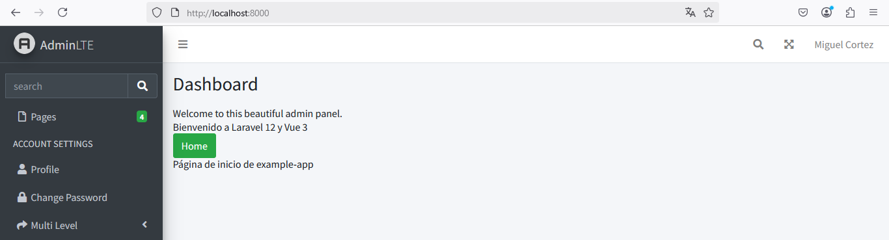

# VUE-ROUTER

## Paso 1. Instalar vue-router

```
npm install vue-router@latest
```
  


## Paso 2. Configurar las rutas en vue-router.

### Cree una carpeta llamada router

Cree una carpeta llamada `router` en el directorio `resources/js`

### Cree un archivo index.js

Crear el archivo `resources/js/router/index.js` para definir las rutas de vue-router.
En este archivo se deben definir todas las rutas que serán gestionadas por vue-router, a continuación se presenta el archivo con una sola ruta creada. La ruta creada es para acceder a **HomeComponent.vue** y se ha definido como la ruta raíz `/`

Contenido del archivo **index.js**  


```javascript
import { createRouter, createWebHistory } from 'vue-router';
import Home from '../components/HomeComponent.vue';

const routes = [
    { path: '/', component: Home }
];

const router = createRouter({
    history: createWebHistory(),
    routes,
});

export default router;
```

## Paso 3. Cree el archivo HomeComponent.vue

Este archivo debe ser creado en :file_folder: `resources/js/components`. El nombre del archivo será `HomeComponent.vue`.  

Contenido del archivo **HomeComponent.vue**    

```php
<template>
    <div>
        <h2>Página de inicio de example-app</h2>
    </div>
</template>
```

## Paso 4. Modifique el archivo appVue.js

Vamos a modificar el archivo **appVue.js** para que cargue las rutas definidas en el archivo **index.js**  

Nuevo contenido del archivo:  

```javascript
import { createApp } from 'vue';
import App from './components/App.vue';
import router from './router';

const app = createApp(App);
app.use(router);
app.mount('#app');
```

## Paso 5. Agregue un router-view

Para que el contenido de las rutas se pueda mostrar en el navegador web se necesita tener un `router-view`. Por el momento, este elemento lo agregaremos en el archivo `App.vue`  

Este será el nuevo contenido del archivo **App.vue**  

```php
<template>
    <div>
        <h1>Bienvenido a Laravel 12 y Vue 3</h1>
        <router-link to="/" class="btn btn-success">Home</router-link>
        <router-view></router-view>
    </div>
</template>
```

Note que se agregó `<router-view></router-view>`  

## Paso 6. Ejecutar la aplicación

```
npm run dev
```
```
php artisan serve
```

Acceder a la URL `http://localhost:8000` y autenticarse.

Así se verá el componente de vue ya cargado (App.vue):  

  

# Referencias

https://dev.to/robin-ivi/laravel-12-and-vue-3-ultimate-starter-guide-3bmd
