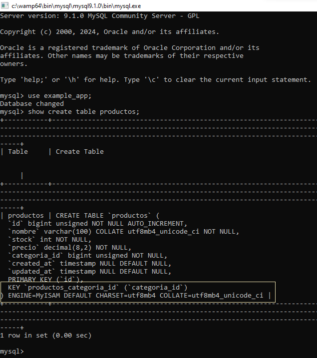
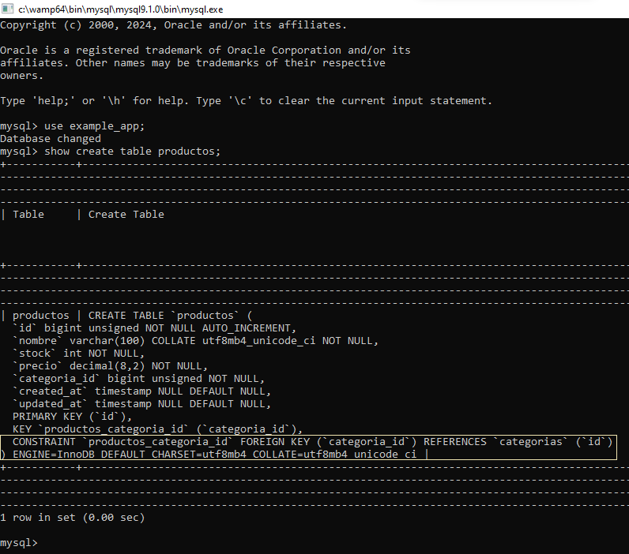

# Base de datos

:books: Las migraciones predeterminadas del proyecto de Laravel ya fueron ejecutadas con el comando `php artisan migrate`.  

## Crear las migraciones

:pushpin: Es importante seguir un formato estándar a la hora de nombrar la migración para que se cree de forma conveniente. Me refiero a usar nombres como `createCategoriasTable` y `createProductosTable`. Creo que también se pueden usar nombres como `create_categorias_table`  y  `create_productos_table`.  

```
php artisan make:migration createCategoriasTable
```

```
php artisan make:migration createProductosTable
```

## Definir las migraciones.

Nota. Se pretende mostrar cómo crear tablas relacionadas.  

#### Forma 1:

:pushpin: Esta forma necesita que se cree el campo y luego se defina la llave foránea.  

```php
Schema::table('posts', function (Blueprint $table) {
    $table->unsignedBigInteger('user_id');
    $table->foreign('user_id')->references('id')->on('users');
});
```
#### Forma 2:  
:pushpin: Esta forma define automáticamente el campo de la llave foránea y la relación entre las tablas.  

##### Forma 2.a:  

```php
Schema::table('posts', function (Blueprint $table) {
    $table->foreignId('user_id')->constrained();
});
```

Con este formato crea automáticamente el campo para la relación en la tabla hija y además, hace la referencia automáticamente con la tabla padre. Se basa en la idea de que los nombres de tablas y campos siguen un mismo estándar. Por ejemplo, como en `foreingId` se está usando el campo `user_id`, Laravel ya sabe que debe relacionarse con una tabla llamada `users` (en plural). Desventaja para nosotros que hablamos español "Los nombres los pluraliza basados en el inglés, no en español". Si bien recuerdo que se puede pluralizar en español, pero es necesario hacer algunas otras configuraciones.

:star: Por suerte, tenemos otra alternativa que he documentado como `Forma 2.b` por cuestiones de refencia.  

##### Forma 2.b:  
```php
Schema::table('posts', function (Blueprint $table) {
    $table->foreignId('user_id')->constrained(
        table: 'users', indexName: 'posts_user_id'
    );
});
```

## Definir la migración para la tabla categorias (tabla padre)
`database\migrations\2025_05_18_113438_create_categorias_table.php`  

```php
<?php

use Illuminate\Database\Migrations\Migration;
use Illuminate\Database\Schema\Blueprint;
use Illuminate\Support\Facades\Schema;

return new class extends Migration
{
    /**
     * Run the migrations.
     */
    public function up(): void
    {
        Schema::create('categorias', function (Blueprint $table) {
            $table->id();
            $table->string("nombre",100);
            $table->timestamps();
        });
    }

    /**
     * Reverse the migrations.
     */
    public function down(): void
    {
        Schema::dropIfExists('categorias');
    }
};
```  

## Definir la migración para la tabla productos (tabla hija)

:books: Se ha utilizado la segunda forma explicada arriba.  

`database\migrations\2025_05_18_142457_create_productos_table.php`  

```php
<?php

use Illuminate\Database\Migrations\Migration;
use Illuminate\Database\Schema\Blueprint;
use Illuminate\Support\Facades\Schema;

return new class extends Migration
{
    /**
     * Run the migrations.
     */
    public function up(): void
    {
        Schema::create('productos', function (Blueprint $table) {
            $table->id();
            $table->string("nombre",100);
            $table->integer("stock");
            $table->decimal('precio', total: 8, places: 2);
            $table->foreignId('categoria_id')->constrained(
                table: 'categorias', indexName: 'productos_categoria_id'
            );
            $table->timestamps();
        });
    }

    /**
     * Reverse the migrations.
     */
    public function down(): void
    {
        Schema::dropIfExists('productos');
    }
};
```  

:books: A pesar de la relación entre las tablas `cateogorias` y `productos`, cuando se ejecutan las migraciones, la definición de las tablas no tienen la restricción. Por lo tanto, se puede ingresar un producto aún cuando `categoria_id` no tenga un valor equivalente en la tabla de `categorias`. La razón es que por defecto, el proyecto de Laravel no tiene definido el motor de almacenamiento de las bases de datos `engine`.  

  

Observe la línea siguiente:  
**CONSTRAINT `productos_categoria_id` FOREIGN KEY (`categoria_id`) REFERENCES `categorias` (`id`)**  

```php
<?php

use Illuminate\Support\Str;

return [

    // comentarios omitidos

    'default' => env('DB_CONNECTION', 'sqlite'),

    // comentarios omitidos

    'connections' => [

      // configuraciones omitidas

        'mysql' => [
            'driver' => 'mysql',
            'url' => env('DB_URL'),
            'host' => env('DB_HOST', '127.0.0.1'),
            'port' => env('DB_PORT', '3306'),
            'database' => env('DB_DATABASE', 'laravel'),
            'username' => env('DB_USERNAME', 'root'),
            'password' => env('DB_PASSWORD', ''),
            'unix_socket' => env('DB_SOCKET', ''),
            'charset' => env('DB_CHARSET', 'utf8mb4'),
            'collation' => env('DB_COLLATION', 'utf8mb4_unicode_ci'),
            'prefix' => '',
            'prefix_indexes' => true,
            'strict' => true,
            'engine' => null,
            'options' => extension_loaded('pdo_mysql') ? array_filter([
                PDO::MYSQL_ATTR_SSL_CA => env('MYSQL_ATTR_SSL_CA'),
            ]) : [],
        ],

      // configuraciones omitidas

    ],

];
```
:warning: El comportamiento expuesto se debe a la siguiente configuración `'engine' => null,`. No se ha especificado el `motor de almacenamiento` para la base de datos. Los motores típicos son `MyISAM` e `InnoDB`. Por defecto se utiliza el motor de almacenamiento `MyISAM` y este motor exige las restricciones.

## Especificar el motor de almacenamiento.

```php
<?php

use Illuminate\Support\Str;

return [

    // comentarios omitidos

    'default' => env('DB_CONNECTION', 'sqlite'),

    // comentarios omitidos

    'connections' => [

      // configuraciones omitidas

        'mysql' => [
            'driver' => 'mysql',
            'url' => env('DB_URL'),
            'host' => env('DB_HOST', '127.0.0.1'),
            'port' => env('DB_PORT', '3306'),
            'database' => env('DB_DATABASE', 'laravel'),
            'username' => env('DB_USERNAME', 'root'),
            'password' => env('DB_PASSWORD', ''),
            'unix_socket' => env('DB_SOCKET', ''),
            'charset' => env('DB_CHARSET', 'utf8mb4'),
            'collation' => env('DB_COLLATION', 'utf8mb4_unicode_ci'),
            'prefix' => '',
            'prefix_indexes' => true,
            'strict' => true,
            'engine' => 'InnoDB',
            'options' => extension_loaded('pdo_mysql') ? array_filter([
                PDO::MYSQL_ATTR_SSL_CA => env('MYSQL_ATTR_SSL_CA'),
            ]) : [],
        ],

      // configuraciones omitidas

    ],

];
```

Observe la línea siguiente:  
**CONSTRAINT `productos_categoria_id` FOREIGN KEY (`categoria_id`) REFERENCES `categorias` (`id`)**  

:warning: Ahora la configuración se ha cambiado de `null` a `InnoDB` en `'engine' => null,`. 

## Ejecutar las migraciones.

Si ahora ejecuta las migraciones, ya tendrá las restricciones entre las tablas `caterogias` y `productos`

  

