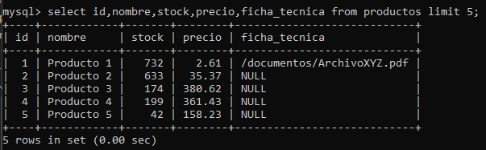
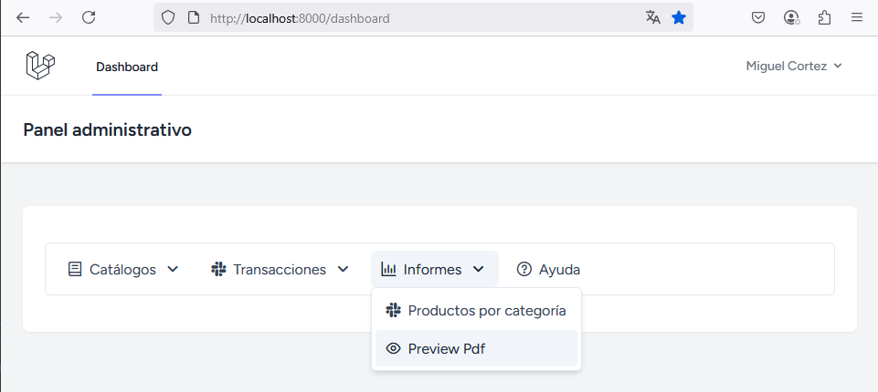
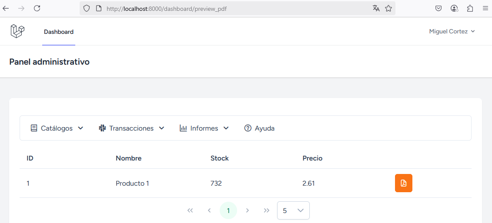
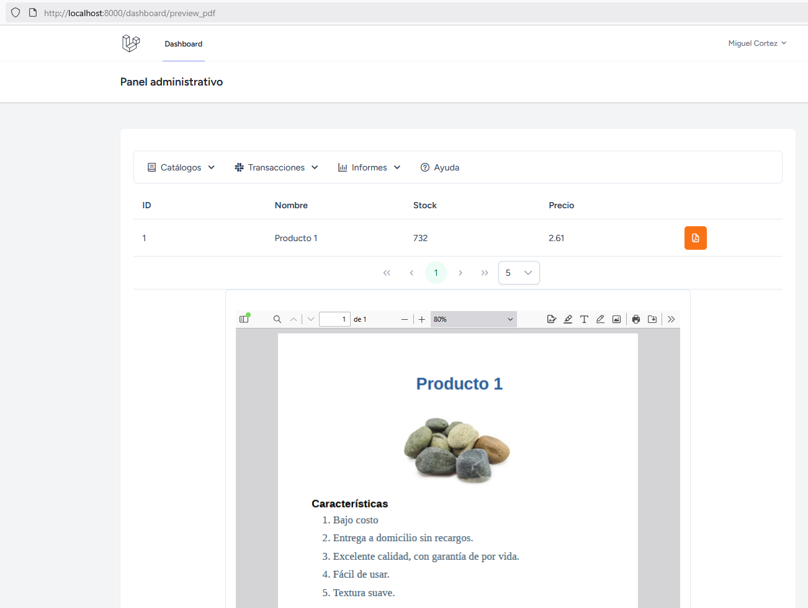

# Visualizar un PDF en un componente de Vue3

## Contexto

Se pretende crear un compoente de Vue3 para mostrar una lista de productos que tengan un archivo PDF asociado. Luego, al hacer clic en un botón mostrar el contenido del archivo PDF en lugar de descargarlo.

## Paso 1. Crear una tabla
La tabla de base de datos que utilizaré en el ejemplo es `productos`. En mi caso, ya tengo la tabla pero agregaré un nuevo campo para guardar la ruta y el nombre del archivo PDF asociado al producto. En este documento no explicaré cómo subir un archivo PDF sino solo cómo mostrarlo.

A continuación muestro la migración (incluyendo el nuevo campo) para la tabla de `productos`:  

```php
<?php

use Illuminate\Database\Migrations\Migration;
use Illuminate\Database\Schema\Blueprint;
use Illuminate\Support\Facades\Schema;

return new class extends Migration
{
    /**
     * Run the migrations.
     */
    public function up(): void
    {
        Schema::create('productos', function (Blueprint $table) {
            $table->id();
            $table->string("nombre",100);
            $table->integer("stock");
            $table->decimal('precio', total: 8, places: 2);
            $table->string("ficha_tecnica",100)->nullable();
            $table->foreignId('categoria_id')->constrained(
                table: 'categorias', indexName: 'productos_categoria_id'
            );
            $table->timestamps();
        });
    }

    /**
     * Reverse the migrations.
     */
    public function down(): void
    {
        Schema::dropIfExists('productos');
    }
};
```

La única línea que agregué es `$table->string("ficha_tecnica",100)->nullable();`.

Luego, es necesario ejecutar nuevamente las migraciones y los seeder (en mi caso). Lo que realmente se necesita es que la tabla de `productos` tenga el nuevo campo.

## Paso 2. Copiar un archivo PDF en el servidor

1. Crear el directorio `public/documentos`. En realidad, el directorio que va a crear es **documentos** porque **public** ya existe.
2. Copiar un archivo PDF en el directorio `public/documentos`. En este ejemplo, el archivo que copié se llama `ArchivoXYZ.pdf`.
3. La ruta que que se debe guardar en el campo `ficha_tecnica` de la tabla `productos` es `/documentos/ArchivoXYZ.pdf`  

## Paso 3. Agregar la información del archivo PDF en la tabla
 
Puede insertar la información de diferentes maneras; pero yo utilicé el siguiente comando para actualizar el registro con :id: 1:  

```sql
update productos set ficha_tecnica = "/documentos/ArchivoXYZ.pdf" where id = 1;
```

:books: (OPCIONAL). A continuación, presento los 5 primeros productos, obtenidos con el comando `select id,nombre,stock,precio,ficha_tecnica from productos limit 5;`    

  


:books: (OPCIONAL). También actualicé el modelo `Producto` para incluir el campo `ficha_tecnica` en la variable `$fillable` (:zap: no afecta para este ejemplo)  

```php
<?php  
// código omitido  
class Producto extends Model
{
    // código omitido
    protected $fillable = ['nombre','stock','precio','ficha_tecnica'];
}
```  

## Paso 4. Crear el componente de Vue3

```javascript
<template>
    <div class="card">
        <DataTable :value="productos" paginator :rows="5" :rowsPerPageOptions="[5, 10, 20, 50]" tableStyle="min-width: 50rem">
            <Column field="id" header="ID" style="width: 25%"></Column>
            <Column field="nombre" header="Nombre" style="width: 25%"></Column>
            <Column field="stock" header="Stock" style="width: 25%"></Column>
            <Column field="precio" header="Precio" style="width: 25%"></Column>
            <Column header="&nbsp;" style="min-width: 12rem">
                <template #body="slotProps">
                    <Button icon="pi pi-file-pdf" v-tooltip.top="'Ver ficha técnica'" severity="warn" @click="cargarPdf(slotProps.data)" />
                </template>
            </Column>
        </DataTable>
    </div>
    <div class="card flex flex-col items-center gap-4">
    <Panel>
    <iframe :src="url" width="800" height="600" style="border: none;">
    </iframe>
    </Panel>
    </div>
</template>

<script setup>
import { ref, onMounted } from "vue";
import Panel from 'primevue/panel';
import DataTable from 'primevue/datatable';
import Column from 'primevue/column';


const productos = ref([]);
const url = ref(null)

const cargarPdf = async (data) =>{
    url.value = data.ficha_tecnica
}
const getFichasTecnicas = async () => {
  try {
    const response = await axios.get("/api/dashboard/productos/fichas_tecnicas");
    productos.value = response.data
  } catch (err) {
    console.error(err);
  }
};
onMounted(
    getFichasTecnicas(),    
    cargarPdf()
)
</script>
```
## Paso 5. Agregar una nueva función a ProductoController

```php
public function obtenerFichasTecnicas(){
  try{
    $productos = DB::table('productos')
    ->whereNotNull('ficha_tecnica')
    ->get();
    return response()->json($productos);
  }catch(\Exception $e){
    return $e->getMessage();
  }
}
```
:star: La función `obtenerFichasTecnicas()`  retorna los productos que tienen un archivo PDF asociado. Son todos los productos donde el campo `ficha_tecnica` tiene un valor diferente del valor  `null` 

## Paso 6. Agregar una nueva ruta (vue-router)
Esta ruta se utilizará para acceder al componente `PreviewPdfFileComponent` desde el menú de la aplicación.  

En mi caso, el archivo que he modificado es `resources\js\components\App.vue`  

```javascript
<template>
// código omitido
</template>
<script setup>
// código omitido
const router = useRouter();

const items = ref([
    // código omitido
    {
        label: 'Informes',
        icon: 'pi pi-chart-bar',
        items: [
            // código omitido
            {
                icon: 'pi pi-eye',
                label: 'Preview Pdf',
                route: '/dashboard/preview_pdf', // ESTA ES LA RUTA DE INTERÉS.
            },
        ]
    },
    // código omitido
]);
</script>

<style scoped>

</style>
```
:star: No he tenido la necesidad de crear una nueva ruta en `web.php` porque estoy usando la misma ruta:  

```php
Route::get('/dashboard/{p1?}', function () {
    return view('dashboard_menubar');
})->middleware(['auth', 'verified'])->name('dashboard');
```
donde `preview_pdf` se sustituye en el parámetro `{p1}` de la ruta.  

## Paso 7. Ejecutar la aplicación

### Opción de menú para cargar el componente.

  

### Para cargar el componente, haga clic en Preview Pdf  

  

Como solo el producto con :id: 1 tiene documento pdf asociado (ficha técnica) se presenta solo una fila de datos.

### Para ver el archivo PDF, haga clic en el botón de color naranja.

  

