# spatie/laravel-permission

## Antes de comenzar

:star: Es bueno comentar que he creado el proyecto con los comandos propuestos por la página oficial de laravel (laravel.com)  y además, he instalado `laravel/breeze` para la gestión de usuarios y la autenticación; entonces, algunas de las tablas mostradas abajo pueden ser producto de laravel/breeze (:zzz: no lo he confirmado).

:star: Quiero dejar constancia de las tablas que tiene la base de datos antes de comenzar con la configuración de `spatie/laravel-permission` 

Comando:  

```sql
show tables
``` 

  

## Paso 1. Prerequisitos

Para las versiones de `Laravel 8,9,10,11,12` se requiere la versión del paquete `^6.0 (PHP 8.0+)`. Información tomada de `https://spatie.be/docs/laravel-permission/v6/prerequisites`  

El modelo `User` implementa el contrator `Illuminate\Contracts\Auth\Access\Authorizable`, en caso contrario, los métodos `can()` y `authorize()` no funcionan en los controladores, políticas, plantillas, etc.  

En las instrucciones de instalación se indica que `HasRoles` debe ser agregado al modelo `User` para habilitar estas características del paquete.  

En el siguiente código se muestran las características mínimas que debe tener el modelo `User`:  

```php
use Illuminate\Foundation\Auth\User as Authenticatable;
use Spatie\Permission\Traits\HasRoles;

class User extends Authenticatable
{
    use HasRoles;

    // ...
}
```

El modelo que tengo actualmente en el proyecto se presenta en el siguiente bloque de instrucciones. Tiene más código; pero no incluye actualmente las instrucciones indicadas arriba.  

```php
<?php

namespace App\Models;

// use Illuminate\Contracts\Auth\MustVerifyEmail;
use Illuminate\Database\Eloquent\Factories\HasFactory;
use Illuminate\Foundation\Auth\User as Authenticatable;
use Illuminate\Notifications\Notifiable;

class User extends Authenticatable
{
    /** @use HasFactory<\Database\Factories\UserFactory> */
    use HasFactory, Notifiable;

    /**
     * The attributes that are mass assignable.
     *
     * @var list<string>
     */
    protected $fillable = [
        'name',
        'email',
        'password',
    ];

    /**
     * The attributes that should be hidden for serialization.
     *
     * @var list<string>
     */
    protected $hidden = [
        'password',
        'remember_token',
    ];

    /**
     * Get the attributes that should be cast.
     *
     * @return array<string, string>
     */
    protected function casts(): array
    {
        return [
            'email_verified_at' => 'datetime',
            'password' => 'hashed',
        ];
    }
}
```
:star: Recordatorio. Yo tengo instalado `Laravel/Breeze` y no sé si este paquete agregó alguna tabla al proyecto creado o si modificó el modelo `User`.  

A continuación presento las modificaciones que realicé en el modelo `User`:  


```php
<?php

namespace App\Models;
// código omitido
use Illuminate\Foundation\Auth\User as Authenticatable; // ESTA LINEA YA ESTABA

use Spatie\Permission\Traits\HasRoles; // LINEA AGREGADA

class User extends Authenticatable
{
    // código omitido
    use HasRoles; // LINEA AGREGADA
    // código omitido
}

```

Referencia: `https://spatie.be/docs/laravel-permission/v6/prerequisites` 

## Paso 2. Instalación / configuración

:star: Este paquete publica un archivo de configuración en `config/permission.php`. Si tiene algún archivo con el mismo nombre es necesario renombrarlo o borrarlo antes de continuar.  

**Comando para instalar el paquete**  
```
composer require spatie/laravel-permission
```
  

**(OPCIONAL). Registre el proveedor de servicios**  

En teoría este proceso se realiza automáticamente; pero si prefiere hacerlo de forma manual debe agregar esta línea en un archivo de configuración que cambia en función de la versión de Laravel:

`Spatie\Permission\PermissionServiceProvider::class`   

Archivo de configuración para versiones recientes de Laravel `bootstrap/providers.php` 

Archivo de configuración para Laravel 10 o anteriores `config/app.php`  

En mi caso, el archivo `` tenía el siguiente código:  

```php
<?php

return [
    App\Providers\AppServiceProvider::class,
];
```

Ya modificado me quedó así:  

```php
<?php

return [
    App\Providers\AppServiceProvider::class,
    Spatie\Permission\PermissionServiceProvider::class, // LINEA AGREGADA
];
```

**Publicar la migración y config/permission.php**  

```
php artisan vendor:publish --provider="Spatie\Permission\PermissionServiceProvider"
```
  

**Antes de ejecutar las migraciones**

Según la página oficial de **spatie/laravel-permission**, antes de ejecutar las migraciones deberíamos tomar en cuenta algunos criterios que pueden ser diferentes para cada proyecto o para configuraciones diferentes del entorno de trabajo; pero esta parte yo la voy a omitir por ahora. Si más adelante en proceso me falla, analizaré este apartado.  

Para más información consulte `https://spatie.be/docs/laravel-permission/v6/installation-laravel` en la sección `6. BEFORE RUNNING MIGRATIONS`.  

**Limpiar las configuraciones de cache**  

```
php artisan optimize:clear
```
o
```
php artisan config:clear
```

  

**Ejecutar las migraciones**

```
php artisan migrate
```

  

Las tablas después de las migraciones:  

  

## 3. Roles y permisos

Los comandos que aquí se utilizan pueden incluirse en funciones de los controladores del modelo `MVC` y por consiguiente, ejecutar las acciones desde archivos de Blade o componentes de Vue.  

Para probar la funcionalidad de `laravel-permission`  utilizaré `Tinker` porque en esencia lo que interesa es:  

* Crear roles.
* Crear permisos.
* Agregar permisos a roles.
* Crear usuarios.
* Agregar roles a los usuarios.
* Consultar roles, permisos, usuarios
* Quitar roles, permisos, usuarios, etc.

Luego se puede pogramar para que estas acciones sean incorporadas en los controladores y acceder desde la interfaz gráfica de usuario del proyecto.  

:key: Pero al final, lo más importante es que una vez creados los roles, permisos y usuarios puedan tener un efecto práctico en la autenticación y autorización. Esto significa por ejemplo que basado en los roles el usuario pueda tener acceso solo a algunas opciones del menú, restrigir rutas, etc.  

Lo expuesto anteriormente se puede probar sin importar el método que haya utilizado para crear roles, permisos y usuarios. Digo esto porque incluso se pueden ingresar los datos utilizando `seeders` o `factories`; incluso manualmente en las tablas de la base de datos si conoce en qué tablaa insertar cada uno de los elementos requeridos(roles, usuarios, permisos, etc.).  

### 3.1 Ingresar a Tinker

```
php artisan tinker
```
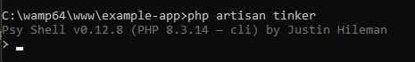  

### 3.2 Incluir Role y Permission en la consola Tinker

:star: Estas dos líneas son necesarias para utilizar los modelos `Role` y `Permission` de `spatie/laravel-permission` 

```php
use Spatie\Permission\Models\Role;
use Spatie\Permission\Models\Permission;
```

### 3.3 Crear un rol llamado `estandar`

Este rol será posteriormente asignado a los usuarios comunes (no administradores).

```php
$role = Role::create(['name' => 'estandar']);
```

### 3.4 Crear un permiso para editar productos

```php
$permission = Permission::create(['name' => 'editar productos']);
```
:eye: Evidencias de los pasos **3.1 - 3.4**  

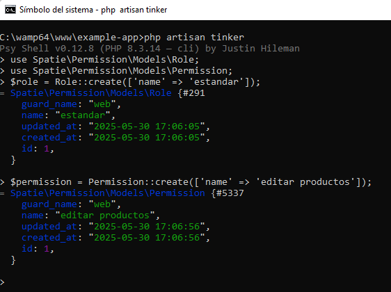  

Consultando la tabla `roles` en la consola de `MySQL`:  


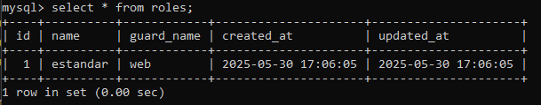  

Consultando la tabla `permissions` en la consola de `MySQL`:  


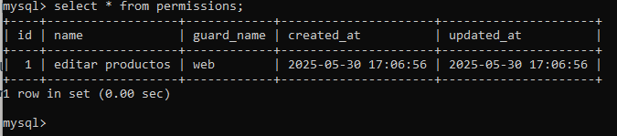  

### 3.5 Asignar el permiso `editar productos` al rol `estandar` 

Este proceso se puede hacer con uno de los dos siguientes comandos (el resultado es el mismo):  

```php
$role->givePermissionTo($permission);
```

o

```php
$permission->assignRole($role);
```

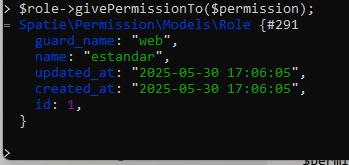  

Consultando la tabla `role_has_permissions` en la consola de `MySQL` 

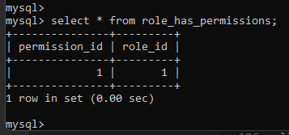  

Recordatorio:  
* El permiso `1` es `editar productos` 
* El rol `1` es `estandar` 

**REMOVER PERMISOS**
:star: La variable `$permission` debe tener un objeto de tipo `Permission` de `spatie/laravel-permission`. En este momento se podría remover el permiso `editar productos` del rol `estandar` sin buscarlo el permiso porque la variable `$permission` ya tiene la información del permiso que creamos arriba ("editar productos")  

```php
$role->revokePermissionTo($permission);
```
o

```php
$permission->removeRole($role);
```

:zap: Yo por el momento no necesito remover el permiso `editar productos` del rol `estandar`, por lo tanto, no ejecutaré ninguno de estos comandos.  

Para más información `https://spatie.be/docs/laravel-permission/v6/basic-usage/basic-usage`  

## 4. Usuarios y roles

En este apartado se explicará cómo asignar o remover roles a los usuarios.

### 4.1 Buscar un usuario

Se buscará el usuario con `id` = `1`  

```php
$user = User::find(1);
```

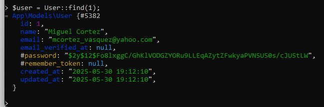  

### 4.2 Asignar roles

Se va a asignar el role `estandar` al usuario que se buscó en el paso anterior.  

```php
$user->assignRole('estandar');
```

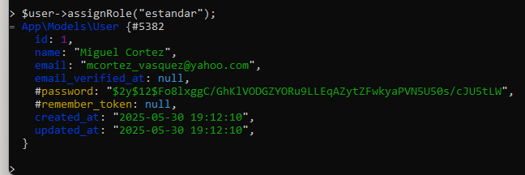  

Consultando la tabla `model_has_roles` en la consola de `MySQL`   

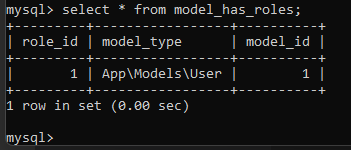  

:star: Se pueden agregar mútliples roles a un usurio utilizando cualquiera de las formas siguientes:  

```php
$user->assignRole('writer', 'admin');
```

```php
$user->assignRole(['writer', 'admin']);
```

**Remover un rol**

Se puede remover el rol `estandar` al usuario usando el siguiente comomando:  

```php
$user->removeRole('estandar');
```

:zap: Sincronizar roles.

Consiste en eliminar todos los roles actuales del usuario y sustituirlos los nuevos roles definidos en el arreglo.

```php
$user->syncRoles(['writer', 'admin']);
```

### 4.3 Verificando los roles.

Para saber si un usuario tiene asignado un rol se puede ejecutar el siguiente comando. El resultado es un valor lógico.  

```php
$user->hasRole('estandar');
```
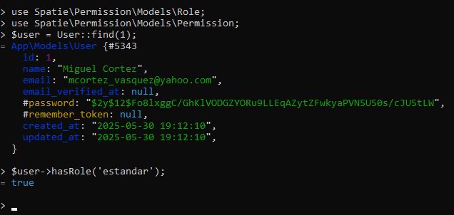  

También se puede saber si tiene por lo menos un rol del los roles pasados en el erreglo.  

```php
$user->hasRole(['editor', 'moderator','estandar']);
```

### 4.4 Verificando si un role tiene un permiso

```php
$role = Role::find(1);
$role->hasPermissionTo('editar productos');
```

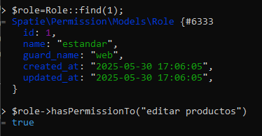  

## 5. Usuarios y permisos

:star: **LA MEJOR PRÁCTICA** es asignar permisos a los roles y luego, asginar roles a usuarios.

### 5.1 Asignar un permisos a un usuario  

```php
$user->givePermissionTo('agregar productos');
```
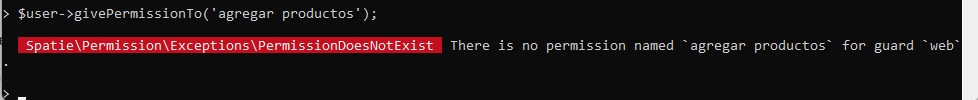  

:pushpin: A pesar de que el permiso parece ser una simple cadena, el permiso debe estar agregado en la base de datos.

**Recordarotiro** Un permiso se puede crear con el comando siguiente:  

```php
$permission = Permission::create(['name' => 'agregar productos']);
```

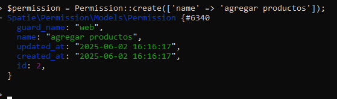  


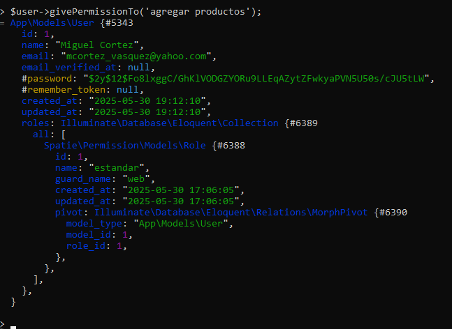  


:books: Puede agregar múltiples permisos a un usuario en un solo comando (tiene dos formas):  

```php
$user->givePermissionTo('agregar productos', 'editar productos', 'eliminar productos');
```

```php
$user->givePermissionTo(['agregar productos', 'editar productos', 'eliminar productos']);
```

### 5.2 Eliminar permisos a un usuario

```php
$user->revokePermissionTo('agregar productos');
```

### 5.3 Verificando los permisos directos de un usuario

```php
$user->can('agregar productos');
```

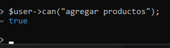  

```php
$user->can('editar productos');
```

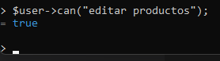  

:star: Note que aún cuando el permiso `editar productos` fue asignado al rol `estandar` y luego, el rol `estandar` asignado al usuario, el comando `$user->can('editar productos');` devuelve `true` 

**Otra forma** para determinar si un usuario tiene asignado un permiso:  

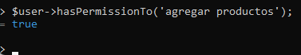  

CONSULTANDO LAS TABLAS:  

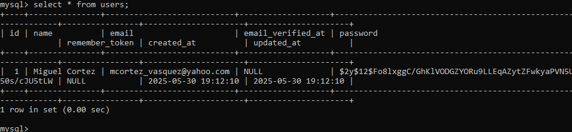  

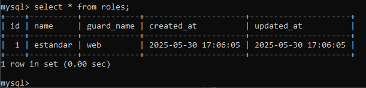  

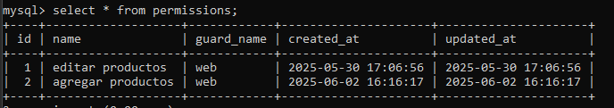  

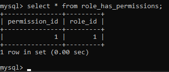  

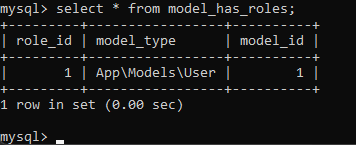  

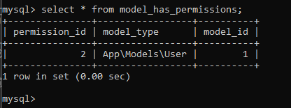  

