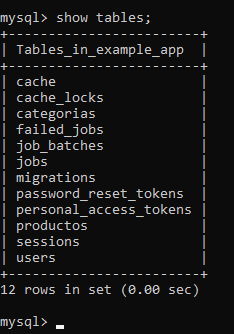
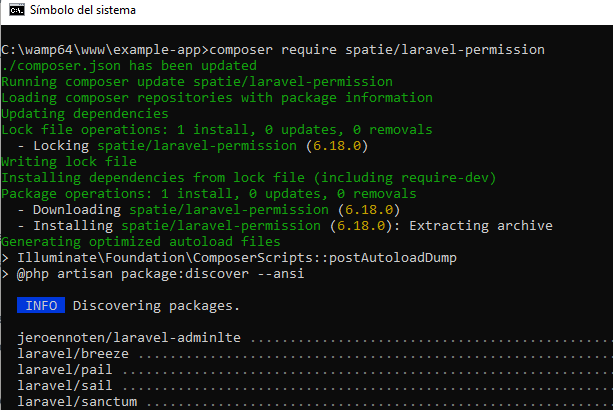
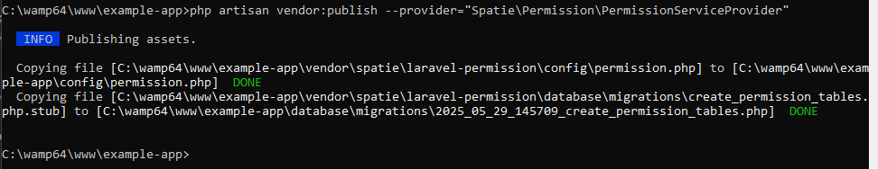
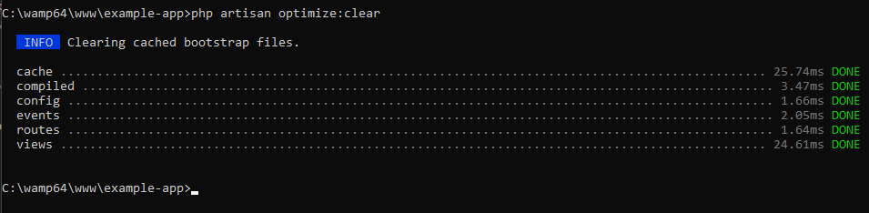
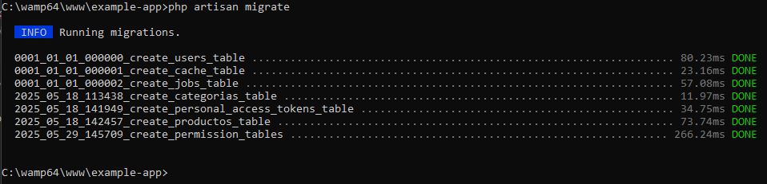
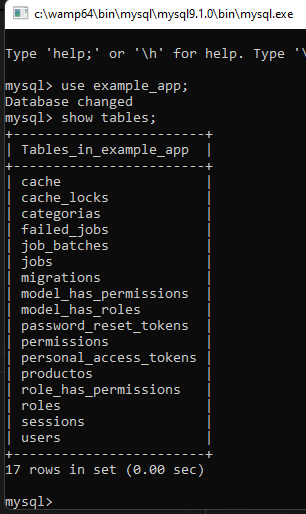

# SPATIE/LARAVEL-PERMISSION. INSTALACIÓN Y CONFIGURACIÓN

## ANTES DE COMENZAR

:star: Es bueno comentar que he creado el proyecto con los comandos propuestos por la página oficial de laravel (laravel.com)  y además, he instalado `laravel/breeze` para la gestión de usuarios y la autenticación; entonces, algunas de las tablas mostradas abajo pueden ser producto de laravel/breeze (no lo he confirmado).

:star: Quiero dejar constancia de las tablas que tiene la base de datos antes de comenzar con la configuración de `spatie/laravel-permission` 

Comando:  

```sql
show tables
``` 

  

## PASO 1. PREREQUISITOS

Para las versiones de `Laravel 8,9,10,11,12` se requiere la versión del paquete `^6.0 (PHP 8.0+)`. Información tomada de `https://spatie.be/docs/laravel-permission/v6/prerequisites`  

El modelo `User` implementa el contrator `Illuminate\Contracts\Auth\Access\Authorizable`, en caso contrario, los métodos `can()` y `authorize()` no funcionan en los controladores, políticas, plantillas, etc.  

En las instrucciones de instalación se indica que `HasRoles` debe ser agregado al modelo `User` para habilitar estas características del paquete.  

En el siguiente código se muestran las características mínimas que debe tener el modelo `User`:  

```php
use Illuminate\Foundation\Auth\User as Authenticatable;
use Spatie\Permission\Traits\HasRoles;

class User extends Authenticatable
{
    use HasRoles;

    // ...
}
```

El modelo que tengo actualmente en el proyecto se presenta en el siguiente bloque de instrucciones. Tiene más código; pero no incluye actualmente las instrucciones indicadas arriba.  

```php
<?php

namespace App\Models;

// use Illuminate\Contracts\Auth\MustVerifyEmail;
use Illuminate\Database\Eloquent\Factories\HasFactory;
use Illuminate\Foundation\Auth\User as Authenticatable;
use Illuminate\Notifications\Notifiable;

class User extends Authenticatable
{
    /** @use HasFactory<\Database\Factories\UserFactory> */
    use HasFactory, Notifiable;

    /**
     * The attributes that are mass assignable.
     *
     * @var list<string>
     */
    protected $fillable = [
        'name',
        'email',
        'password',
    ];

    /**
     * The attributes that should be hidden for serialization.
     *
     * @var list<string>
     */
    protected $hidden = [
        'password',
        'remember_token',
    ];

    /**
     * Get the attributes that should be cast.
     *
     * @return array<string, string>
     */
    protected function casts(): array
    {
        return [
            'email_verified_at' => 'datetime',
            'password' => 'hashed',
        ];
    }
}
```
:star: Recordatorio. Yo tengo instalado `Laravel/Breeze` y no sé si este paquete agregó alguna tabla al proyecto creado o si modificó el modelo `User`.  

A continuación presento las modificaciones que realicé en el modelo `User`:  


```php
<?php

namespace App\Models;
// código omitido
use Illuminate\Foundation\Auth\User as Authenticatable; // ESTA LINEA YA ESTABA

use Spatie\Permission\Traits\HasRoles; // LINEA AGREGADA

class User extends Authenticatable
{
    // código omitido
    use HasRoles; // LINEA AGREGADA
    // código omitido
}

```

Referencia: `https://spatie.be/docs/laravel-permission/v6/prerequisites` 

## PASO 2. INSTALACIÓN / CONFIGURACIÓN

:star: Este paquete publica un archivo de configuración en `config/permission.php`. Si tiene algún archivo con el mismo nombre es necesario renombrarlo o borrarlo antes de continuar.  

**Comando para instalar el paquete**  
```
composer require spatie/laravel-permission
```
  

**(OPCIONAL). Registre el proveedor de servicios**  

En teoría este proceso se realiza automáticamente; pero si prefiere hacerlo de forma manual debe agregar esta línea en un archivo de configuración que cambia en función de la versión de Laravel:

`Spatie\Permission\PermissionServiceProvider::class`   

Archivo de configuración para versiones recientes de Laravel `bootstrap/providers.php` 

Archivo de configuración para Laravel 10 o anteriores `config/app.php`  

En mi caso, el archivo `` tenía el siguiente código:  

```php
<?php

return [
    App\Providers\AppServiceProvider::class,
];
```

Ya modificado me quedó así:  

```php
<?php

return [
    App\Providers\AppServiceProvider::class,
    Spatie\Permission\PermissionServiceProvider::class, // LINEA AGREGADA
];
```

**Publicar la migración y config/permission.php**  

```
php artisan vendor:publish --provider="Spatie\Permission\PermissionServiceProvider"
```
  

**Antes de ejecutar las migraciones**

Según la página oficial de **spatie/laravel-permission**, antes de ejecutar las migraciones deberíamos tomar en cuenta algunos criterios que pueden ser diferentes para cada proyecto o para configuraciones diferentes del entorno de trabajo; pero esta parte yo la voy a omitir por ahora. Si más adelante en proceso me falla, analizaré este apartado.  

Para más información consulte `https://spatie.be/docs/laravel-permission/v6/installation-laravel` en la sección `6. BEFORE RUNNING MIGRATIONS`.  

**Limpiar las configuraciones de cache**  

```
php artisan optimize:clear
```
o
```
php artisan config:clear
```

  

**Ejecutar las migraciones**

```
php artisan migrate
```

  

Las tablas después de las migraciones:  

  
