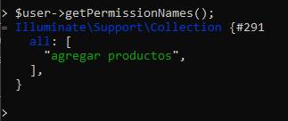
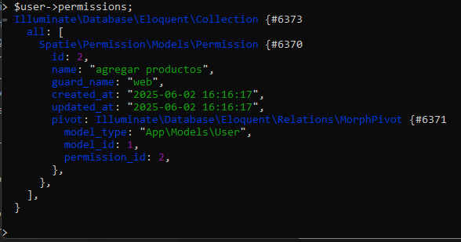
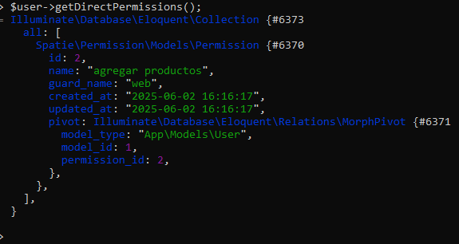
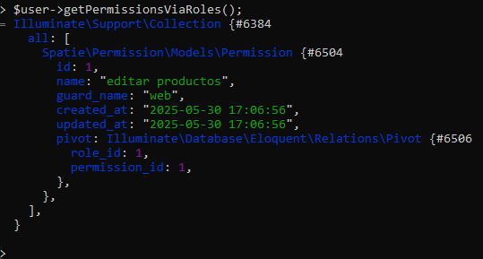
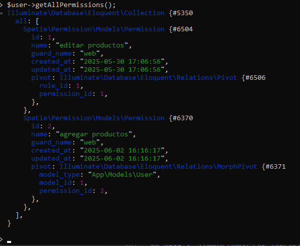

# SPATIE/LARAVEL-PERMISSION 

PARTE II. USO

## 1. INTRODUCCIÓN
:warning: La documentación que aquí presento ha sido tomada del sitio oficial de [spatie/laravel-permission](https://spatie.be/docs/laravel-permission/v6/introduction). Por lo tanto, si usted prefiere puede consultar la documentación oficial. En este documento solo agrego mis propios comentarios y evidencias de la ejecución de algunos comandos con fines académicos.  

:dart: El verdadero objetivo al fin de cuentas es utilizar los usuarios, roles y permisos en un proyecto para bloquer rutas, ocultar opciones de menús, evitar el uso de algunas acciones como eliminar registros mediante el uso de permisos, etc.  

Los comandos que aquí se utilizan pueden incluirse en funciones de los controladores del modelo `MVC` y crear opciones de menús para acceder desde las interfaces gráficas de usaurio; pero para probar la funcionalidad de `spatie/laravel-permission`  utilizaré `Tinker` porque en esencia lo que interesa es:  

* Crear roles.
* Crear permisos.
* Agregar permisos a roles.
* Agregar roles a usuarios.
* Consultar usuarios, roles y permisos
* Quitar roles, permisos, usuarios, etc.


:key: Pero al final, lo más importante es que una vez creados los roles, permisos y usuarios puedan tener un efecto práctico en la autenticación y autorización. Esto significa por ejemplo que basado en los roles el usuario pueda tener acceso solo a algunas opciones del menú, restrigir rutas, etc.  Esto se puede probar sin importar el método que haya utilizado para crear roles, permisos y usuarios. Digo esto porque se pueden ingresar los datos utilizando `seeders` o `factories`; incluso manualmente en las tablas de la base de datos si conoce en qué tabla insertar cada uno de los elementos requeridos (roles, usuarios, permisos, etc.).  

## 2. USO DE LARAVEL-PERMISSION

### 2.1 INGRESAR A LA CONSOLA DE TINKER

```
php artisan tinker
```
  

### 2.2 INCLUIR ROLE Y PERMISSION EN LA CONSOLA DE TINKER

:star: Estas dos líneas son necesarias para utilizar los modelos `Role` y `Permission` de `spatie/laravel-permission` 

```php
use Spatie\Permission\Models\Role;
use Spatie\Permission\Models\Permission;
```

### 2.3 ROLES Y PERMISOS

#### 2.3.1 Crear un rol llamado `estandar`

Este rol será posteriormente asignado a los usuarios comunes (no administradores).

```php
$role = Role::create(['name' => 'estandar']);
```

#### 2.3.2 Crear un permiso para editar productos

```php
$permission = Permission::create(['name' => 'editar productos']);
```

  

Consultando la tabla `roles` en la consola de `MySQL`:  


  

Consultando la tabla `permissions` en la consola de `MySQL`:  


  

#### 2.3.3 Asignar el permiso `editar productos` al rol `estandar` 

Este proceso se puede hacer con uno de los dos siguientes comandos (el resultado es el mismo):  

```php
$role->givePermissionTo($permission);
```

o

```php
$permission->assignRole($role);
```

  

Consultando la tabla `role_has_permissions` en la consola de `MySQL` 

  

Recordatorio:  
* El permiso `1` es `editar productos` 
* El rol `1` es `estandar` 

#### 2.3.4 Remover un permiso

:star: La variable `$permission` debe tener un objeto de tipo `Permission` de `spatie/laravel-permission`. En este momento se podría remover el permiso `editar productos` del rol `estandar` sin buscarlo el permiso porque la variable `$permission` ya tiene la información del permiso que creamos arriba ("editar productos")  

```php
$role->revokePermissionTo($permission);
```
o

```php
$permission->removeRole($role);
```

:zap: Yo por el momento no necesito remover el permiso `editar productos` del rol `estandar`, por lo tanto, no ejecutaré ninguno de estos comandos.  

Para más información `https://spatie.be/docs/laravel-permission/v6/basic-usage/basic-usage`  

### 2.4 USUARIOS Y ROLES

En este apartado se explicará cómo asignar o remover roles a los usuarios.

#### 2.4.1 Buscar un usuario

En la práctica, quizá ya tenga acceso a usuario autenticado o no necesitaría buscarlo de forma explícita como aquí se hará; pero para fines académicos me parece bien.  

Se buscará el usuario con `id` = `1`  

```php
$user = User::find(1);
```

  

#### 2.4.2 Asignar roles

Se va a asignar el role `estandar` al usuario que se buscó en el paso anterior.  

```php
$user->assignRole('estandar');
```

  

Consultando la tabla `model_has_roles` en la consola de `MySQL`   

  

:books: Se pueden agregar mútliples roles a un usuario:  

Forma 1  
```php
$user->assignRole('writer', 'admin');
```

Forma 2  
```php
$user->assignRole(['writer', 'admin']);
```

#### 2.4.3 Remover un rol.

Se puede remover el rol `estandar` al usuario usando el siguiente comomando; pero no será necesario hacerlo:  

```php
$user->removeRole('estandar');
```

#### 2.4.4 Sincronizar roles

Consiste en eliminar todos los roles actuales del usuario y sustituirlos los nuevos roles definidos en el arreglo.

```php
$user->syncRoles(['writer', 'admin']);
```

#### 2.4.5 Verificando los roles.

Para saber si un usuario tiene asignado un rol se puede ejecutar el siguiente comando. El resultado es un valor lógico.  

```php
$user->hasRole('estandar');
```
  

También se puede saber si tiene por lo menos un rol de los enviados como argumento de tipo arreglo a la función hasRole().  

```php
$user->hasRole(['editor', 'moderator','estandar']);
```

#### 2.4.6 Verificando si un role tiene un permiso

```php
$role = Role::find(1);
$role->hasPermissionTo('editar productos');
```

  

### 2.5 USUARIOS Y PERMISOS

:no_entry_sign: Esta no es la mejor práctica. 

:white_check_mark: Es mejor asignar permisos a roles y roles a usuarios.  

#### 2.5.1 Asignar un permiso a un usuario  

```php
$user->givePermissionTo('agregar productos');
```
  

:pushpin: A pesar de que el permiso parece ser una simple cadena, el permiso debe estar agregado en la base de datos.

**Recordarotiro** Un permiso se puede crear con el comando siguiente:  

```php
$permission = Permission::create(['name' => 'agregar productos']);
```

  


  


:books: Puede agregar múltiples permisos a un usuario en un solo comando:  

Forma 1  
```php
$user->givePermissionTo('agregar productos', 'editar productos', 'eliminar productos');
```

Forma 2   
```php
$user->givePermissionTo(['agregar productos', 'editar productos', 'eliminar productos']);
```

#### 2.5.2 Eliminar permisos a un usuario

```php
$user->revokePermissionTo('agregar productos');
```

#### 2.5.3 Verificando los permisos directos de un usuario

```php
$user->can('agregar productos');
```

  

```php
$user->can('editar productos');
```

  

:star: Note que aún cuando el permiso `editar productos` fue asignado al rol `estandar` y luego, el rol `estandar` asignado al usuario, el comando `$user->can('editar productos');` devuelve `true` 

**Otra forma** para determinar si un usuario tiene asignado un permiso:  

  

### 2.6. OBTENER ROLES Y PERMISOS VINCULADOS A UN USUARIO

:books: Anteriormente se han utilizado comandos para verificar por ejemplo si un usuario tiene un rol o un permiso, obteniendo un valor lógico; sin embargo, algunas veces es necesario obtener los roles asignados a un usuario, los permisos asignados a un rol, los permisos directos asociados a un usuario o lo permisos asociados a un usuario de forma indirecta a mediante la asignación de roles. En esta sección se han documentado estos comandos.

#### 2.5.1 Obtener la colección de roles de un usuario.

Vamos a asumir que la información de un usuario ya la tenemos en la variable `$user`.

```php
$roles = $user->getRoleNames();
```

  

#### 2.5.2 Obtener los permisos de un usuario

##### 2.5.2.1 Obtener solo los nombres de los permisos

```php
$permissionNames = $user->getPermissionNames();
```

  

##### 2.5.2.2 Obtener los objetos de los permisos

```php
$permissions = $user->permissions;
```

  

##### 2.5.2.3 Obtener los permisos asignados directamente

Son los permisos que no han sido asignados a los usuarios mediante roles, sino, el permiso asignado de forma directa al usuario.  

```php
$permissions = $user->getDirectPermissions();
```
  

##### 2.5.2.4 Obtener los permisos del usuario via roles

Esto significa que los permisos fueron asignados a los roles y luego, los roles fueron asignados a los usuarios.  

```php
$permissions = $user->getPermissionsViaRoles();
```

  

##### 2.5.2.5 Obtener todos los permisos del usuario independiente de su forma de asignación

```php
$permissions = $user->getAllPermissions();
```

  

## 2.6 Consultando los registros en las tablas de MySQL

En este apartado puede consultar cómo queda guardada la información en las tablas de la base de datos.  

  

  

  

  

  

  

