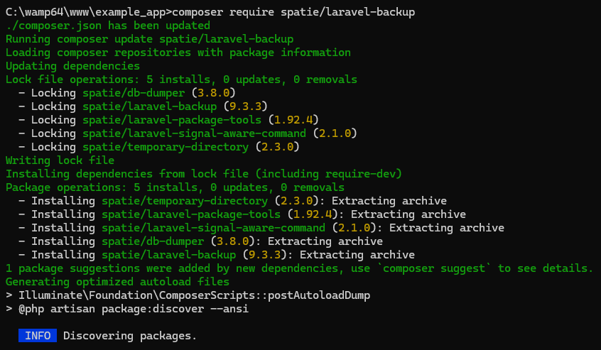
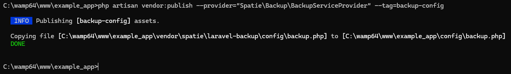
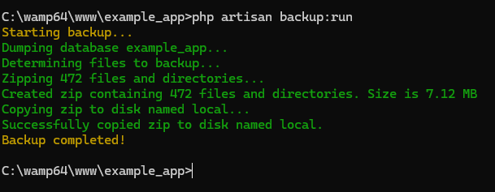
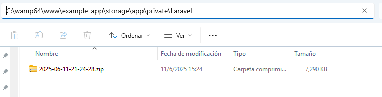
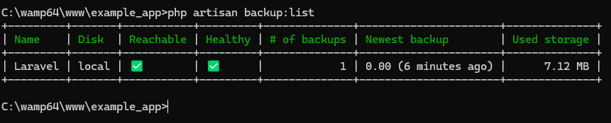
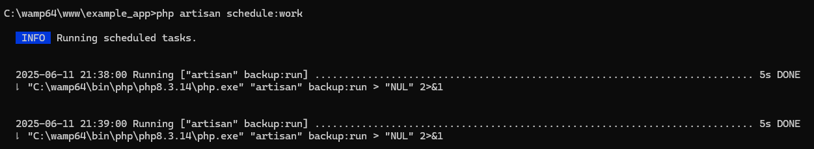
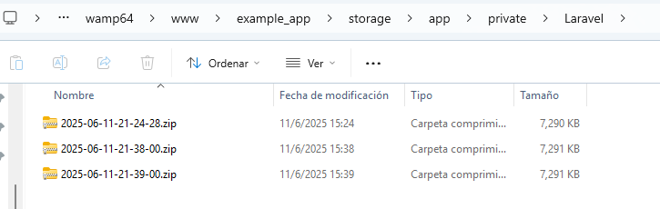
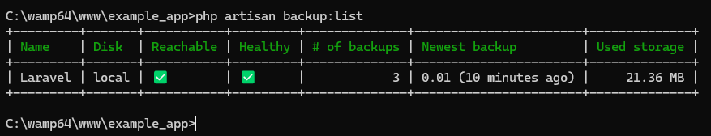
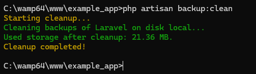

# SPATIE/LARAVEL-BACKUP

## Instalación del paquete laravel-backup

```
composer require spatie/laravel-backup
```

  

## Publicar el archivo de configuración  

Se creará el archivo `config/backup.php` 

Comando:  

```
php artisan vendor:publish --provider="Spatie\Backup\BackupServiceProvider" --tag=backup-config
```

  

Al final del documento se encuentra la referencia, donde podrá ver el contenido por defecto del archivo de configuraciones.  

## (OPCIONAL) Publicar los archivos de idiomas

:star: Yo no ejecuté el comando  

Comando:  

```
php artisan vendor:publish --provider="Spatie\Backup\BackupServiceProvider" --tag=backup-translations
```

## (OPCIONAL) Configurar el directorio de destino para crear el backup   

:star: Yo no configuré un nuevo directorio de destino.    

Esta configuración se hace en `config\filesystems.php`

Se modifica la sección `disks`, en la clave `root` del siguiente contenido:  

```php
<?php

return [

    // código omitido
    'disks' => [

        'local' => [
            'driver' => 'local',
            'root' => storage_path('app/private'),    // AQUÍ SE DEFINE DONDE SE GUARDAN LOS BACKUP
            'serve' => true,
            'throw' => false,
            'report' => false,
        ],

        // código omitido

    ],

  // código omitido

];

```

Por defecto, las copias de seguridad se guardan dentro de un directorio llamado `Laravel` que se crea automáticamente dentro de `C:\wamp64\www\example_app\storage\app\private`.  

## Configurar la ruta de mysqldump.exe  

:star: En realidad, el archivo no solo puede ser `mysqldump.exe` porque podría estar utilizando un gestor de bases de datos diferente de `MySQL` y dependiendo del gestor de base de datos, cambia el programa que hace las copias de seguridad.  

Se debe modificar el archivo `config\database.php` 

```php
<?php

use Illuminate\Support\Str;

return [

  // código omitido

    'connections' => [
      // código omitido
      ,

        'mysql' => [
            // código omitido
            ,
            // LA SECCIÓN DUMP ES LA AGREGADA
		        'dump' => [
		          'dump_binary_path' => 'C:/wamp64/bin/mysql/mysql9.1.0/bin', // only the path, so without `mysqldump` or `pg_dump`
		          'use_single_transaction',
		          'timeout' => 60 * 5, // 5 minute timeout
            ],
            'options' => extension_loaded('pdo_mysql') ? array_filter([
                PDO::MYSQL_ATTR_SSL_CA => env('MYSQL_ATTR_SSL_CA'),
            ]) : [],
        ],

        // código omitido

    ],

    // código omitido

];
```

## Creando un backup desde la consola  

Comando:  
```
php artisan backup:run
```

  

A continuación se muestra el archivo creado:  

  

Mostrando la lista de los backup creados  

  

## Programando backup automáticos

En el archivo `routes\console.php` se pueden programar las tareas:  

```php
<?php

use Illuminate\Foundation\Inspiring;
use Illuminate\Support\Facades\Artisan;
use Illuminate\Support\Facades\Schedule; // línea agregada

// código omitido

//Schedule::command('backup:clean')->daily()->at('09:24');
//Schedule::command('backup:run')->daily()->at('22:38:00');
Schedule::command('backup:run')->everyMinute();
```
:star: En el ejemplo anterior, se ha programado a nivel de demostración para crear un backup a cada minuto.  

Luego, debemos iniciar el trabajo que ha sido programado, para ello, ejecutamos el siguiente comando:  

```
php artisan schedule:work
```

En la imagen siguiente se puede ver la creación de dos copias de seguridad automáticas:  

  


Luego, al ver la carpeta `C:\wamp64\www\example_app\storage\app\private\Laravel` encontraremos lo siguiente:  

  

:books: Si se pregunta por qué hay tres copias de seguridad...es porque ya habíamos realizado una copia manualmente con el comando `php artisan backup:run`  

  

`CTRL + C` deja de ejecutar los backup automáticos.  

## Borrar los backup antiguos  

:star: Proceso que consiste en eliminar los backup obsoletos. Los períodos para resguardar las copias de seguridad están definidos en el archivo `config\backup.php`, en la sección `cleanup`. Existe un período diferente en fución de la frecuencia con que los backup se están creando, es decir, si es diario, tiene un tiempo para guardar la copia; pero si es semanal, tiene otro período para mantener la copia, etc.  

```
php artisan backup:clean
```

  

## Referencia

[Instalación y configuración de laravel-backup](https://spatie.be/docs/laravel-backup/v9/installation-and-setup)  