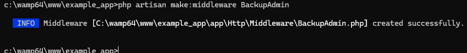
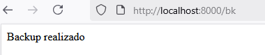
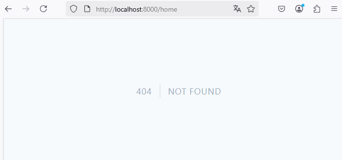

# Middleware

## Contexto

Se pretede crear una ruta web protegida en `routes\web.php` mediante el uso de `Middleware`. Vamos a suponer que la creación copias de seguridad de la base de datos solo estará disponible para algún o algunos usuarios específicos (los que cumplan con los criterios definidos en el middleware).  

## 1. Creación del Middleware

Se creará un middleware con el nombre `BackupAdmin`  

Comando:  

```
php artisan make:middleware BackupAdmin
```

  

Esta es la ruta del archivo creado: `app\Http\Middleware\BackupAdmin.php` y el contenido por defecto del archivo es el siguiente:  

```php
<?php

namespace App\Http\Middleware;

use Closure;
use Illuminate\Http\Request;
use Symfony\Component\HttpFoundation\Response;

class BackupAdmin
{
    /**
     * Handle an incoming request.
     *
     * @param  \Closure(\Illuminate\Http\Request): (\Symfony\Component\HttpFoundation\Response)  $next
     */
    public function handle(Request $request, Closure $next): Response
    {
        return $next($request);
    }
}
```

## 2. Agregar la lógica del Middleware

:books: En el Middleware podemos agregar cualquier lógica que permita determinar los criterios que nosotros queremos que se cumplan para acceder al recurso de destino. En caso que no se cumplan los criterios, vamos a realizar la acción que nosotros decidamos. Cuando las condiciones se haya superado podrá acceder al recurso de destino con el comando `return $next($request)` de la función  `handle` definida en la clase `BackupAdmin`  

El código agregado al Middleware fue el siguiente:  

:one: Importación  

Para tener acceso a la información de usuario autenticado.  

```php
use Illuminate\Support\Facades\Auth;
```

:two: Modificación de la función `handle`:  

Para determinar si el usuario autenticado pertenece al rol `administrador`. En mi caso, estoy utilizando `spatie/laravel-permission` y un usuario puede pertenecer a múltiples roles; pero lo que me interesa en el Middleware (de mi ejemplo) es que uno de los roles del usuario sea administrador, en caso contrario, será dirigido a la ruta `/home` 

```php
  $user = Auth::user();
  $user->getPermissionsViaRoles();
  if ($user->roles[0]->name == "administrador") {
    return redirect('/home');
  }
```

## 3. Registrar globalmente el Middleware

Para registrar el nuevo middleware se modifica el archivo `bootstrap\app.php` 

Contenido original del archivo:  

```php
<?php

use Illuminate\Foundation\Application;
use Illuminate\Foundation\Configuration\Exceptions;
use Illuminate\Foundation\Configuration\Middleware;

return Application::configure(basePath: dirname(__DIR__))
    ->withRouting(
        web: __DIR__.'/../routes/web.php',
        api: __DIR__.'/../routes/api.php',
        commands: __DIR__.'/../routes/console.php',
        health: '/up',
    )
    ->withMiddleware(function (Middleware $middleware) {
        //
    })
    ->withExceptions(function (Exceptions $exceptions) {
        //
    })->create();
```

Al contenido anterior le agregaré el siguiente bloque de código, que luego explico:  

```php
    ->withMiddleware(function (Middleware $middleware) {

        $middleware->append(BackupAdmin::class);

    })
    ->withMiddleware(function (Middleware $middleware) {
        $middleware->alias(['backup' => BackupAdmin::class]);
    })
```

Nuevo contenido del archivo:  

```php
<?php

use Illuminate\Foundation\Application;
use Illuminate\Foundation\Configuration\Exceptions;
use Illuminate\Foundation\Configuration\Middleware;

return Application::configure(basePath: dirname(__DIR__))
    ->withRouting(
        web: __DIR__.'/../routes/web.php',
        api: __DIR__.'/../routes/api.php',
        commands: __DIR__.'/../routes/console.php',
        health: '/up',
    )
    // código omitido
    // Agregué desde aquí
    ->withMiddleware(function (Middleware $middleware) {

        $middleware->append(BackupAdmin::class);

    })
    ->withMiddleware(function (Middleware $middleware) {
        $middleware->alias(['backup' => BackupAdmin::class]);
    })
    // Hasta aquí.
    ->create();
```

:orange_book: El primer bloque, registra el Middleware BackupAdmin de una forma convencional.

:green_book: El segundo bloque, también registra el Middleware; pero además le asigna un alias o sobrenombre que podrá ser utilizado en la ruta que se defina en el archivo `routes\web.php`. Esto será como una manera corta de hacer referencia al mismo Middleware.

:bulb: En la práctica, he observado que puedo utilizar el Middleware aún sin registrarlo. Basta con importar el Middleware `BackupAdmin` en el archivo `routes\web.php` 

## 4. Definiendo la ruta web

Esta ruta se define en el archivo `routes\web.php` 

Lo primero que debemos hacer es importar la clase del Middleware `BackupAdmin` con el siguiente comando:  
```php
use App\Http\Middleware\BackupAdmin;
```


### Forma :a: - Utilizando la clase BackupAdmin de forma explícita
```php
Route::get("/bk", function(){
    $output = shell_exec("C:/wamp64/bin/mysql/mysql9.1.0/bin/mysqldump -u root example_app > C:/Users/macv/Documents/example_app.sql");
    //echo $output;
    echo "Backup realizado";
})->middleware(['auth', 'verified', BackupAdmin::class])->name('bk');
```

### Forma :b: - Utilizando el alias

```php
Route::get("/bk", function(){
    $output = shell_exec("C:/wamp64/bin/mysql/mysql9.1.0/bin/mysqldump -u root example_app > C:/Users/macv/Documents/example_app.sql");
    //echo $output;
    echo "Backup realizado";
})->middleware(['auth', 'verified', BackupAdmin::class])->name('bk');
```

## 5. Creando el backup

Ejecutar la aplicación y acceder a la ruta `http://localhost:8000/bk` 

  

:warning: En caso que no se cumplan las condiciones verificadas en el Middleware, se mostrará el contenido de la vist `home` o en caso que la vista no esté definida se mostrará `NOT FOUND` como en la siguiente imagen:  

  

