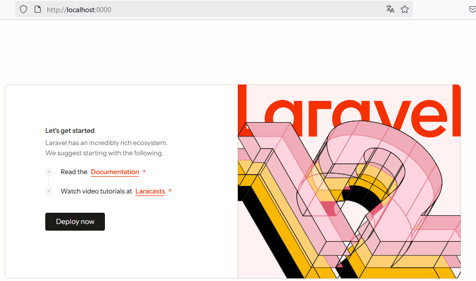
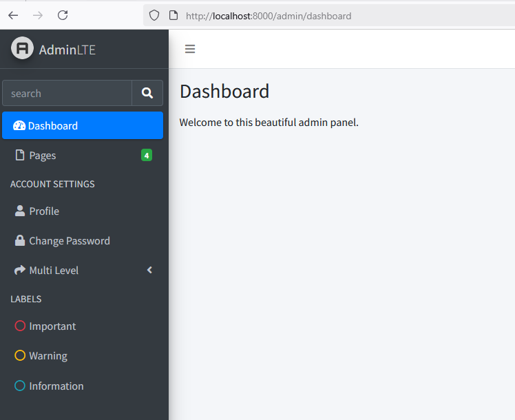
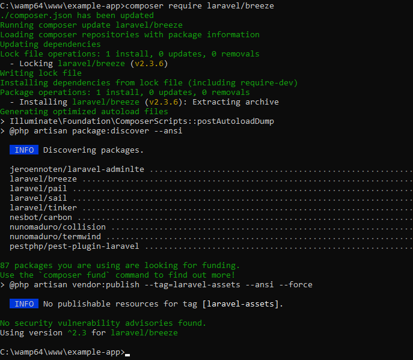
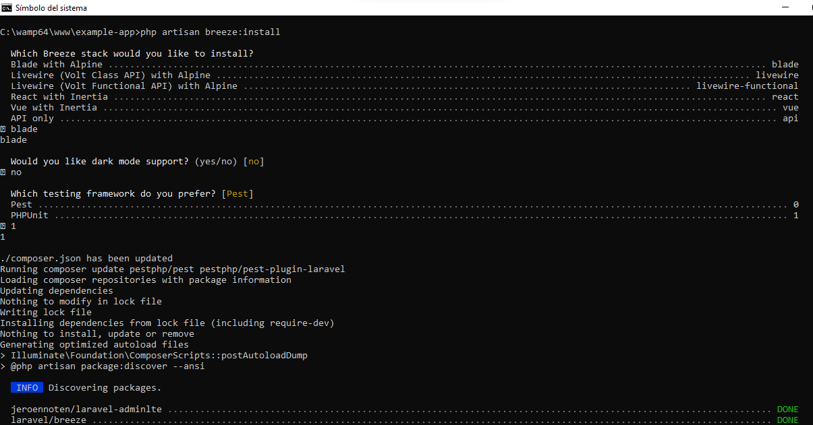
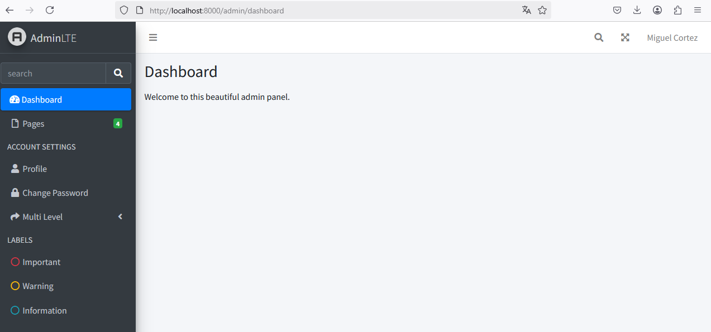
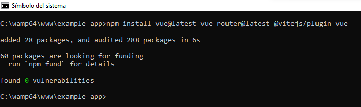
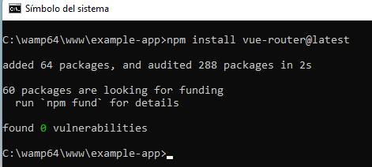

# CREAR UN PROYECTO EN LARAVEL 12
- MySQL
- PHP
- Composer
- NodeJS & npm
- AdminLTE.
- Laravel/Breeze

## Requisitos

1. **WAMPServer** o paquete equivalente. Lo que realmente se necesita es tener instalado MySQL y el módulo de PHP. Las versiones pueden variar pero se recomienda que sea `MySQL 8.0` o superior y `PHP 8.2` o superior.
2. **Composer** instalado. A la hora de instalar composer se pide elegir la versión de PHP compatible con Laravel 12. Yo seleccioné `php-8.2.17`. Composer es un gestor de dependencias de PHP.

## Paso 1. Instalar laravel/installer

```
composer global require laravel/installer
```

## Paso 2. Crear una nueva aplicación

Para crear una nueva aplicaciones tiene varias alternativas. A continuación se muestran algunas formas posibles:

```
laravel new example-app
```

```
composer create-project laravel/laravel example-app
```

```
composer create-project --prefer-dist laravel/laravel example-app "12.*"
```

Responder a las preguntas. Normalmente dejamos las opciones predeterminadas, por lo tanto, solo presionamos ENTER; pero es bueno que lea y cambie sus respuestas si es conveniente.

Este proceso lo he realizado en equipos diferentes y no siempre es igual (me refiero a las preguntas que hace el asistente). Sin duda, esto se debe al hecho de que tengo diferentes versiones o herramientas configuradas en los equipos.

```
 Which starter kit would you like to install? [None]:
  [none    ] None
  [react   ] React
  [vue     ] Vue
  [livewire] Livewire
 >

Which authentication provider do you prefer? [Laravel's built-in authentication]:
  [laravel] Laravel's built-in authentication
  [workos ] WorkOS (Requires WorkOS account)

Which testing framework do you prefer? [Pest]:
  [0] Pest
  [1] PHPUnit

 Would you like to run npm install and npm run build? (yes/no) [yes]:
 >no
```

## Paso 3. Ingresar a la carpeta del proyecto y ejecutarlo.

Ingrese al directorio del proyecto con el comando `cd example-app`

La documentación oficial de Laravel indica que debemos ejecutar los siguientes comandos:

```
npm install && npm run build
composer run dev
```

Nota. Debido a que yo no tengo instalado NodeJS no me han funcionado los comandos `npm install && npm run build` ni `composer run dev`. Después de instalar **NodeJS** sí funcionarán los comandos anteriores; pero para probar que el proyecto funciona no son necesarios por el momento.

## Paso 4. Probar el proyecto

```
php artisan serve

```

Nota. Se puede acceder al sitio web desde el navegador web. `http://localhost:8000`

Debido a que no he configurado la base de datos se muestra el siguiente error:  


Antes de continuar, detenga la aplicación con `Control + C` 

## Paso 5. Descargar e instalar Visual Studio Code.

- Descargue Visual Studio Code.
- Instale Visual Studio Code.
- Abra la carpeta `example-app` en Visual Studio Code.

## Paso 6. Configuraciones de base de datos.

Estas configuracionese se realizan en el archivo  `example-app\.env`

```sql
DB_CONNECTION=sqlite
# DB_HOST=127.0.0.1
# DB_PORT=3306
# DB_DATABASE=laravel
# DB_USERNAME=root
# DB_PASSWORD=
```

Las configuraciones quedarán como se muestra en el siguiente ejemplo:  

```sql
DB_CONNECTION=mysql
DB_HOST=127.0.0.1
DB_PORT=3306
DB_DATABASE=example_app
DB_USERNAME=root
DB_PASSWORD=
```

## Paso 7. Ejecutar las migraciones.
Ahora que ya indicó qué gestor de base de datos utilizará y el nombre de la base de datos que quiere crear, ejecute las migraciones.  
`php artisan migrate`

Como la base de datos aún no existe, le hará la siguiente pregunta (responda yes): 

```
WARN  The database 'example_app' does not exist on the 'mysql' connection.
Would you like to create it? (yes/no) [yes]
```


:collision: Yo tuve problemas a la hora de ejecutar las migraciones. Las siguientes imágenes muestran una evidencia de ello.  

  

  

Al parecer, los errores se deben a la longitud predeterminada de las cadenas en el proyecto de Laravel 12.  

**SOLUCIÓN**

- Abrir el archivo `app/Providers/AppServiceProvider.php`
- En la parte superior del archivo debe hacer la siguiente importación:  `use Illuminate\Support\Facades\Schema` 
- En el archivo `AppServiceProvider.php` tiene una función llamada `boot()` y debe modificarla como sigue:  
    ```public function boot(): void
    {
        Schema::defaultStringLength(191);
    }
    ```
- Ejecutar nuevamente las migraciones `php artisan migrate` 

      

**:eyes: COMENTARIOS (lectura opcional)**
---
A pesar de la solución expuesta, al ejecutar el procedimiento en otra computadora encontré lo siguiente:

- La computadora tiene instaladas varias versiones de MySQL.
- En `Laragon`  tengo :open_file_folder: mysql-8.0.30-winx64 y :open_file_folder: mysql-8.4.3-winx64.
- En wamp64 tengo :open_file_folder: mysql9.1.0. 
    
- La consola `CMD` reconoce la versión de `MySQL 8.0.30`. Esto lo puedo verificar con el comando `mysql --version`.
- Entiendo que se ejecutó la migración utilizando el ejecutable `C:\laragon\bin\mysql\mysql-8.0.30-winx64\bin` cuando el servicio de `MySQL` en ejecución corresponde al alojado en `C:\wamp64\bin\mysql\mysql9.1.0\bin`.  
- El error se genera por la configuración de la variable `PATH` de Windows.
- Para solucionar el problema, agregué la ruta `C:\wamp64\bin\mysql\mysql9.1.0\bin` a la variable `PATH` de Windows.  
- Borré la base de datos `drop database example_app`
- Volví a ejecutar las migraciones `php artisan migrate`.
- También comento que los servicios de `Laragon` estaban detenidos. 
- Quizá mucha explicación; pero a futuro estos comentarios pueden ser de utilidad.

    **Nivel de usuario:**  
      

    **Nivel de sistema:**  
      

    NOTA. Lo ideal sería utilizar una misma versión de MySQL.  Además, basta con tener la ruta de MySQL a nivel de usuario o a nivel de sistema; pero mi configuración está tal cual lo expliqué.  
---

## Paso 8. Descargar e instalar NodeJS

**¿Por qué es necesario ejecutar los siguientes comandos?**   
Obserque en la siguiente imagen. No se puede ejecutar npm run dev.  


Después de descargar e instalar NodeJS, ejecuté nuevamente las instrucciones del **Paso 3** y ahora sí funcionaron.

```
npm install && npm run build
composer run dev
```

OTRA EXPERIENCIA. En otra computadora.  
En otro equipo tenía `node v20.10.0` y no me funcionaron los comandos.
La versión de `node` la puede averiguar con el comando `node --version`. En este equipo instalé la versión `v24.0.1` de `node`.   

Error a la hora de tratar de instalar `npm` 

  

Similar como me ocurrió con MySQL, tengo problemas con las diferentes versiones de nodejs, npm, php, composer. Entonces, me aseguré de configurar correctamente la variable PATH para que la cosonla `CMD` trabaje con las versiones actualizadas.

  


Encontré un archivo llamado `.npmrc` en el directorio :file_folder: `c:\users\macv\`. El archivo tenía el contenido que presento abajo. Borré el contenido, guardé y ahora sí funcionó el comando. Sin embargo, creo que lo que hace es alertarme de componentes que a futuro ya no estarán disponibles.
<details>
<summary>.npmrc</summary>
registry=https://registry.npm.taobao.org/
disturl=https://npm.taobao.org/dist
chromedriver-cdnurl=https://npm.taobao.org/mirrors/chromedriver
couchbase-binary-host-mirror=https://npm.taobao.org/mirrors/couchbase/v{version}
debug-binary-host-mirror=https://npm.taobao.org/mirrors/node-inspector
electron-mirror=https://npm.taobao.org/mirrors/electron/
flow-bin-binary-host-mirror=https://npm.taobao.org/mirrors/flow/v
fse-binary-host-mirror=https://npm.taobao.org/mirrors/fsevents
fuse-bindings-binary-host-mirror=https://npm.taobao.org/mirrors/fuse-bindings/v{version}
git4win-mirror=https://npm.taobao.org/mirrors/git-for-windows
gl-binary-host-mirror=https://npm.taobao.org/mirrors/gl/v{version}
grpc-node-binary-host-mirror=https://npm.taobao.org/mirrors
hackrf-binary-host-mirror=https://npm.taobao.org/mirrors/hackrf/v{version}
leveldown-binary-host-mirror=https://npm.taobao.org/mirrors/leveldown/v{version}
leveldown-hyper-binary-host-mirror=https://npm.taobao.org/mirrors/leveldown-hyper/v{version}
mknod-binary-host-mirror=https://npm.taobao.org/mirrors/mknod/v{version}
node-sqlite3-binary-host-mirror=https://npm.taobao.org/mirrors
node-tk5-binary-host-mirror=https://npm.taobao.org/mirrors/node-tk5/v{version}
nodegit-binary-host-mirror=https://npm.taobao.org/mirrors/nodegit/v{version}/
operadriver-cdnurl=https://npm.taobao.org/mirrors/operadriver
phantomjs-cdnurl=https://npm.taobao.org/mirrors/phantomjs
profiler-binary-host-mirror=https://npm.taobao.org/mirrors/node-inspector/
puppeteer-download-host=https://npm.taobao.org/mirrors
python-mirror=https://npm.taobao.org/mirrors/python
rabin-binary-host-mirror=https://npm.taobao.org/mirrors/rabin/v{version}
sass-binary-site=https://npm.taobao.org/mirrors/node-sass
sodium-prebuilt-binary-host-mirror=https://npm.taobao.org/mirrors/sodium-prebuilt/v{version}
sqlite3-binary-site=https://npm.taobao.org/mirrors/sqlite3
utf-8-validate-binary-host-mirror=https://npm.taobao.org/mirrors/utf-8-validate/v{version}
utp-native-binary-host-mirror=https://npm.taobao.org/mirrors/utp-native/v{version}
zmq-prebuilt-binary-host-mirror=https://npm.taobao.org/mirrors/zmq-prebuilt/v{version}
strict-ssl=true
</details>

Ahora sí funcionó `npm install`  o `npm install && npm run build` 

Solo instalar las dependencias:  

  

Instalar las dependencias y ejecutar a la vez:  
  

Pienso que ejecutar `npm run build` no es necesario en este momento; pero así está en el ejemplo.  

# INSTALACIÓN DE ADMINLTE

## Paso 9. Configure el paquete jeroennoten/laravel-adminlte

`composer require jeroennoten/laravel-adminlte`

  

## Paso 10. Publique los assets de AdminLTE en su proyecto.

`php artisan adminlte:install`  

  


## Paso 11. Crear una vista para el panel administrativo.

- Haga una nueva carpeta llamada `admin` en el directorio `resources\views`
- Dentro de la carpeta recién creada, haga un nuevo archivo llamado `dashboard.blade.php` 

El contenido para el archivo `dashboard.blade.php` se puede obtener de la siguiente URL:  
`https://jeroennoten.github.io/Laravel-AdminLTE/sections/overview/usage.html`

Si no quiere consultar la URL, este es contenido que puede utilizar:  
```php
@extends('adminlte::page')

@section('title', 'Dashboard')

@section('content_header')
    <h1>Dashboard</h1>
@stop

@section('content')
    <p>Welcome to this beautiful admin panel.</p>
@stop

@section('css')
    {{-- Add here extra stylesheets --}}
    {{-- <link rel="stylesheet" href="/css/admin_custom.css"> --}}
@stop

@section('js')
    <script> console.log("Hi, I'm using the Laravel-AdminLTE package!"); </script>
@stop
```

## Paso 12. Agregar una opción en el menú.

Para agregar una opción en el menú lateral de la plantilla AdminLTE puede editar el archivo `config/adminlte.php`

Por ejemplo, para crear un enlace para el dashboard, puede agregar la siguiente configuración:  

```Javascript
'menu' => [
    [
        'text' => 'Dashboard',
        'url'  => 'admin/dashboard',
        'icon' => 'fas fa-tachometer-alt',
    ],
    // Add more menu items here
],
```

  

:book: Nota. ver líneas de 318 a 322 en la imagen anterior.

## Paso 13. Crear un controlador para la plantilla dashboard.

`php artisan make:controller Admin/DashboardController`

## Paso 14. Programar la función index del controlador para llamar la vista

```php
namespace App\Http\Controllers\Admin;

use App\Http\Controllers\Controller;

class DashboardController extends Controller
{
    public function index()
    {
        return view('admin.dashboard');
    }
}
```

## Paso 15. Crear una ruta para la administración del sitio.

Nota. La ruta debe crearse en `routes\web.php` 

```php
Route::get('admin/dashboard', [App\Http\Controllers\Admin\DashboardController::class, 'index'])->name('admin.dashboard');
```

Recomendación. Es mejor que la ruta sea protegida. Para ello, puede utilizar el siguiente ejemplo (solo los usuarios autenticados podrán ingresar a dicha ruta)  

```php
Route::get('admin/dashboard', [App\Http\Controllers\Admin\DashboardController::class, 'index'])
    ->middleware('auth')
    ->name('admin.dashboard');
```

## Paso 16. Ejecutar el proyecto y probar AdminLTE.

```
npm run dev
php artisan serve
```

visitar `http://localhost:8000`  

  

visitar `http://localhost:8000/admin/dashboard`  


  


# LARAVEL/BREEZE

Laravel/Breeze permite gestionar la creación de cuentas de usuario, el acceso y las configuraciones del perfil de usuario.  

## Paso 17. Configure el paquete laravel/breeze

`composer require laravel/breeze`

  

## Paso 18. Instale el paquete.

```
php artisan breeze:install
```

  

Nota. Durante el asistente de instalación pregunta qué herramienta utilizará para hacer pruebas. Yo seleccioné `PHPUnit` quizá no lo utilicemos.  

## Paso 19. Ejecutar comandos.

```
npm install
npm run dev
```

Nota. Recuerde que **npm install** instala las dependencias necesarias.  

## Paso 20. Ejecutar las migraciones

```
php artisan migrate
```

Nota. En mi caso, cuando ejecuté las migraciones en este punto no encontró nada que migrar.  Mensaje ` INFO  Nothing to migrate.` 

## Paso 21. Probar la aplicación.

```
php artisan serve
```
  

Nota. Ya se integró Laravel/Breeze; pero con este proceso se borró la ruta que añadí manualmente para el dashboard y tuve necesidad de agregar nuevamente para poder acceder al dashboard administrativo.

Me refiero a esta ruta que fue creada en el paso 15.

```
Route::get('admin/dashboard', [App\Http\Controllers\Admin\DashboardController::class, 'index'])->name('admin.dashboard');
```

Hay que agregar nuevamente la ruta en `routes\web.php` pero suguiero que se agregue la ruta protegida con `middleware` 

```php
Route::get('admin/dashboard', [App\Http\Controllers\Admin\DashboardController::class, 'index'])
    ->middleware('auth')
    ->name('admin.dashboard');
```

El archivo de rutas finalmente quedará así:  

```php
<?php

use App\Http\Controllers\ProfileController;
use Illuminate\Support\Facades\Route;

Route::get('/', function () {
    return view('welcome');
});

Route::get('/dashboard', function () {
    return view('dashboard');
})->middleware(['auth', 'verified'])->name('dashboard');

Route::middleware('auth')->group(function () {
    Route::get('/profile', [ProfileController::class, 'edit'])->name('profile.edit');
    Route::patch('/profile', [ProfileController::class, 'update'])->name('profile.update');
    Route::delete('/profile', [ProfileController::class, 'destroy'])->name('profile.destroy');
});

Route::get('admin/dashboard', [App\Http\Controllers\Admin\DashboardController::class, 'index'])
    ->middleware('auth')
    ->name('admin.dashboard');

require __DIR__.'/auth.php';
```

  

# CONFIGURAR VUE Y VUE-ROUTER

## Paso 22. Instalar vue y las dependencias adicionales.

```
npm install vue@latest vue-router@latest @vitejs/plugin-vue
```

  
## Paso 23. Configurar vite para que funcione con vue.
Las configuraciones se realizarán en `vite.config.js` 

Configuraciones originales:  

```javascript
import { defineConfig } from 'vite';
import laravel from 'laravel-vite-plugin';

export default defineConfig({
    plugins: [
        laravel({
            input: ['resources/css/app.css', 'resources/js/app.js'],
            refresh: true,
        }),
    ],
});
```
Configuraciones modificadas:  

```javascript
import { defineConfig } from 'vite';
import vue from '@vitejs/plugin-vue';
import laravel from 'laravel-vite-plugin';

export default defineConfig({
    plugins: [
        laravel({
            input: ['resources/js/app.js'],
            refresh: true,
        }),
        vue(),
    ],
});
```

Nota. Se agregaron las líneas `import vue from '@vitejs/plugin-vue';` y `vue(),`  

## Paso 24. Crear un punto de entrada para la aplicación Vue.

Nota. Es común crear en este punto un archivo llamado `app.js` con las configuraciones de la aplicación `vue`; pero en mi caso, ya tengo un archivo con ese nombre, creado por Laravel/Breeze si no me equivoco. Entonces, vamos a crear otro archivo con el nombre `appVue.js`  

El archivo será creado en :file_folder: ` resources\js`

El contenido del archivo será el siguiente:  

```javascript
import { createApp } from 'vue';
import App from './components/AppComponent.vue';
import router from './router';

createApp(App).use(router).mount('#app');
```

Espero no confundir entre el archivo `appVue.js` que va a tener las configuaciones de la aplicación `vue` con el archivo `AppComponent.vue` que representa a un componente que será creado. **AppComponent.vue** es por decir algo, como la página principal de la aplicación Vue; pero perfectamente puede tener otro nombre. Similar a este componente vamos a crear otros como **ProductoComponent.vue**, **VentaComponent.vue**, etc. Donde usar la palabra **Component** al final del nombre solo es una convención.  

## Paso 25. Crear un componente de vue

Antes de crear el primer componente, vamos a crear una carpeta llamada `components` en el directorio `resources\js` 

Después de creada la carpeta, agregue un nuevo archivo llamado `App.vue` dentro del directorio `resources\js\components`  

El contenido del archivo `AppComponent.vue` será el siguiente: 

```javascript
<template>
    <div>
        <h1>Bienvenido a Laravel 12 y Vue 3</h1>
    </div>
</template>
```

## Paso 26. Instalar vue-router

```
npm install vue-router@latest
```
  
## Paso 27. Configurar las rutas en vue-router.

Crear el archivo `resources/js/router/index.js` para definir las rutas de vue-router.
En este archivo se deben definir todas las rutas que será gestionadas por vue-router, a continuación se presenta el archivo con una sola ruta creada. La ruta creada es para acceder al componente Home.vue y se ha definido como la ruta raíz `/`

Nota. El componente `HomeComponent.vue` es un componente más como `AppComponent.vue` y debe ser creado por nosotros para que funciones.  

```javascript
import { createRouter, createWebHistory } from 'vue-router';
import Home from '../components/HomeComponent.vue';

const routes = [
    { path: '/', component: Home }
];

const router = createRouter({
    history: createWebHistory(),
    routes,
});

export default router;
```

## Paso 28. Cree el archivo HomeComponent.vue

Este archivo debe ser creado en :file_folder: `resources/js/components`. El nombre del archivo será `HomeComponent.vue`.  

Este podría ser el contenido del archivo:  

```php
<template>
    <div>
        <h2>Página de inicio de example-app</h2>
    </div>
</template>
```
## Paso 29. Actualizar la plantilla de Blade

Se actualizará la plantilla de Blade para que ejecute la aplicación de vue y se definirá una área para el despliegue de los componentes.  

La actualización se hará en el archivo `resources/views/layouts/app.blade.php` 

Contenido original: 

```php
<!DOCTYPE html>
<html lang="{{ str_replace('_', '-', app()->getLocale()) }}">
    <head>
        <meta charset="utf-8">
        <meta name="viewport" content="width=device-width, initial-scale=1">
        <meta name="csrf-token" content="{{ csrf_token() }}">

        <title>{{ config('app.name', 'Laravel') }}</title>

        <!-- Fonts -->
        <link rel="preconnect" href="https://fonts.bunny.net">
        <link href="https://fonts.bunny.net/css?family=figtree:400,500,600&display=swap" rel="stylesheet" />

        <!-- Scripts -->
        @vite(['resources/css/app.css', 'resources/js/app.js'])
    </head>
    <body class="font-sans antialiased">
        <div class="min-h-screen bg-gray-100">
            @include('layouts.navigation')

            <!-- Page Heading -->
            @isset($header)
                <header class="bg-white shadow">
                    <div class="max-w-7xl mx-auto py-6 px-4 sm:px-6 lg:px-8">
                        {{ $header }}
                    </div>
                </header>
            @endisset

            <!-- Page Content -->
            <main>
                {{ $slot }}
            </main>
        </div>
    </body>
</html>
```

**REFERENCIAS**

## Instalar laravel/breeze

Referencia inicial: https://codecourse.com/articles/how-to-install-laravel-breeze-on-laravel-12

Referencia más detalles: https://kritimyantra.com/blogs/install-laravel-breeze-package-in-laravel-12

```
composer require laravel/breeze --dev
php artisan breeze:install
```

A la pregunta **Which Breeze stack would you like to install?**, responder con la opción **Blade with Alpine**

## Vue3 en Laravel 12

https://dev.to/robin-ivi/laravel-12-and-vue-3-ultimate-starter-guide-3bmd

## AdminLTE

https://kritimyantra.com/blogs/laravel-12-adminlte-integration-setup-your-stunning-admin-dashboard

## Original

https://jeroennoten.github.io/Laravel-AdminLTE/

## Habilitar las rutas API

```
php artisan install:api
```
