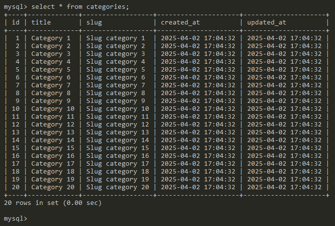
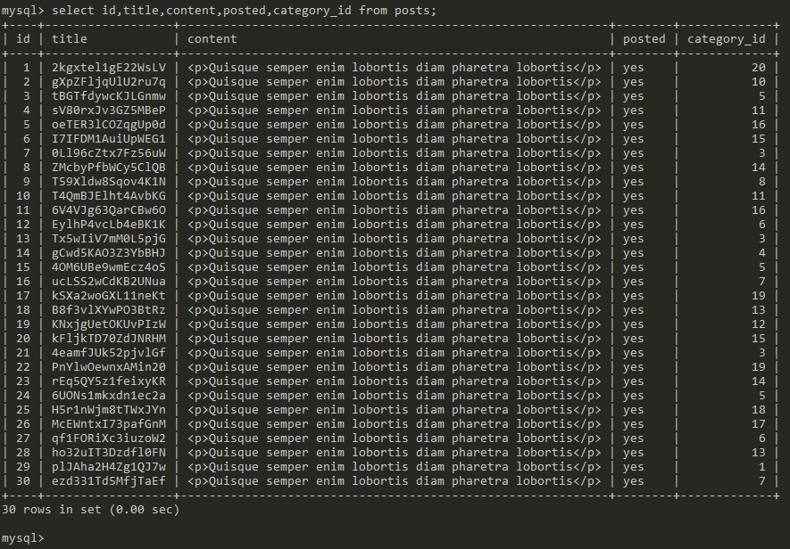
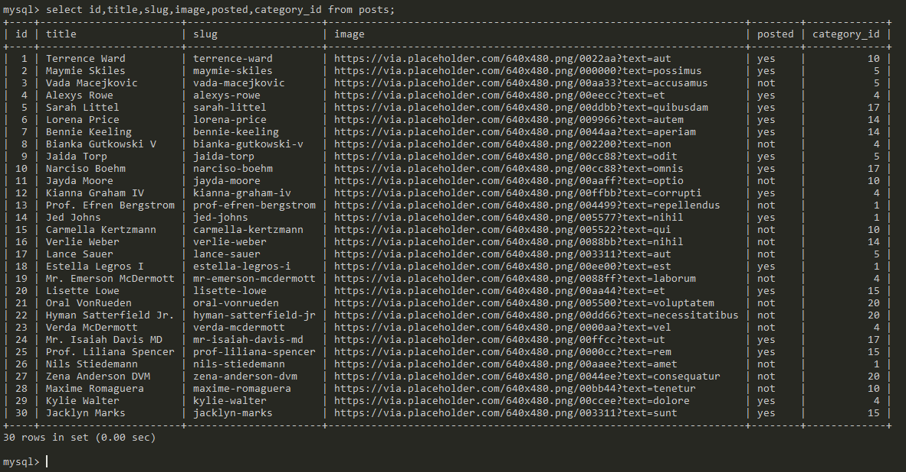

# Seeding & Factories

**Seeding** consiste en la generación de datos de prueba utilizando comandos de Laravel.  

## Crear una migración
Antes de crear los seeders, debemos crear las tablas en la base de datos.  

Vamos a crear las tablas con migraciones, para ello utilizaremos el comando `php artisan make:migration` como se muestra abajo.

`
php artisan make:migration createCategoriesTable
`  

Se ha creado un nuevo archivo:  

`C:\laragon\www\laraprimerospasos\database\migrations/2025_04_01_175405_create_categories_table.php`  

```php
<?php

use Illuminate\Database\Migrations\Migration;
use Illuminate\Database\Schema\Blueprint;
use Illuminate\Support\Facades\Schema;

return new class extends Migration
{
    /**
     * Run the migrations.
     */
    public function up(): void
    {
        Schema::create('categories', function (Blueprint $table) {
            $table->id();
            $table->timestamps();
        });
    }

    /**
     * Reverse the migrations.
     */
    public function down(): void
    {
        Schema::dropIfExists('categories');
    }
};
```
## Definir la estructura de la tabla categories

La tabla `categories` tendrá los campos `title` y `slug`.  

```php
<?php

use Illuminate\Database\Migrations\Migration;
use Illuminate\Database\Schema\Blueprint;
use Illuminate\Support\Facades\Schema;

return new class extends Migration
{
    /**
     * Run the migrations.
     */
    public function up(): void
    {
        Schema::create('categories', function (Blueprint $table) {
            $table->id();
            $table->string("title",500);
            $table->string("slug",500);
            $table->timestamps();
        });
    }

    /**
     * Reverse the migrations.
     */
    public function down(): void
    {
        Schema::dropIfExists('categories');
    }
};
```
Para realizar las migraciones, ejecute el comando `php artisan migrate`. Esto creará la tabla `categories` en la base de datos.  

## Crear el modelo Category
:star: Nota. Solo sería necesario crear el `modelo` y no el `controlador`, pero al final, siempre será necesario tener un controlador para pogramar la lógica relacionada con el modelo `Category` y por tal motivo también estoy creando el controlador (aunque no se use para estos ejemplos).  

```php
php artisan make:model Category -rc
```  

## Modificar el modelo Category (opcional)

Se agregará la línea `protected $fillable = ['title','slug'];` para definir los campos que aceptan insert/update desde la web. Esto se hace por cuestiones de seguridad, pues impide que un usuario mal intencionado agregue campos en un formulario web para insertar información no deseada. El seeder no se ejecuta desde la web, por lo tanto, para este ejemplo es totalmente opcional este paso.

```php
<?php

namespace App\Models;

use Illuminate\Database\Eloquent\Factories\HasFactory;
use Illuminate\Database\Eloquent\Model;

class Category extends Model
{
    use HasFactory;
    protected $fillable = ['title','slug'];
}

```
## Crear CategorySeeder

Se va a crear un seeder para insertar categorías en la tabla `categories` ejecutando el siguiente comando:  

`
php artisan make:seeder CategorySeeder
`  

Se ha creado un nuevo archivo:

`C:\laragon\www\laraprimerospasos\database/seeders/CategorySeeder.php`  
 
```php
<?php

namespace Database\Seeders;

use Illuminate\Database\Console\Seeds\WithoutModelEvents;
use Illuminate\Database\Seeder;

class CategorySeeder extends Seeder
{
    /**
     * Run the database seeds.
     */
    public function run(): void
    {
        //
    }
}
```
## Modificar CategorySeeder para insertar datos en categories

Inicialmente, la función `run()` estaba vacía. Vamos a escribir las instrucciones para insertar datos como se en el siguiente código:  

```php
<?php

namespace Database\Seeders;

use Illuminate\Database\Console\Seeds\WithoutModelEvents;
use Illuminate\Database\Seeder;
use Illuminate\Support\Facades\DB;
use App\Models\Category;
class CategorySeeder extends Seeder
{
    /**
     * Run the database seeds.
     */
    public function run(): void
    {
        DB::statement('SET FOREIGN_KEY_CHECKS=0;');
        Category::truncate();
        DB::statement('SET FOREIGN_KEY_CHECKS=1;');
        for($i=1;$i<=20;$i++){
            Category::create(
                [
                    'title' => "Category $i",
                    'slug' => "Slug category $i"
                ]
            );
        }
    }
}
```
## Agregar CategorySeeder a DatabaseSeeder

Para que el seeder se ejecute con el comando `php artisan db:seed` debemos agregar `CategorySeeder` a `DatabaseSeeder`.  

Escriba la línea `$this->call(CategorySeeder::class);`  


```php
<?php

namespace Database\Seeders;

// use Illuminate\Database\Console\Seeds\WithoutModelEvents;
use Illuminate\Database\Seeder;

class DatabaseSeeder extends Seeder
{
    /**
     * Seed the application's database.
     */
    public function run(): void
    {
        // \App\Models\User::factory(10)->create();

        // \App\Models\User::factory()->create([
        //     'name' => 'Test User',
        //     'email' => 'test@example.com',
        // ]);
        $this->call(CategorySeeder::class);
    }
}
```
## Ejecutar todos los seeders

Por el momento solo temenos `CategorySeeder`. Entonces tenemos dos opciones para ejecutar:

Opción 1 (ejecutar un seeder específico):  
`php artisan db:seed --class=CategorySeeder`

Opción 2 (ejecutar todos los seeders):  
`php artisan db:seed`


:large_orange_diamond: También puede ejecutar las migraciones y los seeders con una misma instrucción:  

`php artisan migrate:refresh  --seed`  

Hasta este punto, ya agregamos registros en la tabla `categories`. Los datos insertados se muestran a continuación:  

  

## Crear una migración para Posts

Para crear una migración para Posts, ejecute el siguiente comando:  

`php artisan make:migration createPostsTable`  

:star: En el comando anterior, es importante seguir el formato en la escritura del nombre de la migración `createPostsTable` porque de esta forma, Laravel autocompleta algunas instrucciones, por ejemplo, el nombre del archivo de la migración, la creación de una tabla llamada `posts`, entre otras.  

Se ha creado un nuevo archivo:

`C:\laragon\www\laraprimerospasos\database\migrations/2025_04_02_145514_create_posts_table.php`

```php
<?php

use Illuminate\Database\Migrations\Migration;
use Illuminate\Database\Schema\Blueprint;
use Illuminate\Support\Facades\Schema;

return new class extends Migration
{
    /**
     * Run the migrations.
     */
    public function up(): void
    {
        Schema::create('posts', function (Blueprint $table) {
            $table->id();
            $table->timestamps();
        });
    }

    /**
     * Reverse the migrations.
     */
    public function down(): void
    {
        Schema::dropIfExists('posts');
    }
};
```
## Definir la estructura que tendrá la tabla posts

En la tabla `posts` se crearán los campos `title. slug, description, content, image y posted`. Además, se definirá una llave foranea que vincula a las tablas `posts` y `categories`. Esto también es realizado de forma correcta porque cumplimos con el estándar a la hora de crear la migración (debido a `createPostsTable`).  

```php
<?php

use Illuminate\Database\Migrations\Migration;
use Illuminate\Database\Schema\Blueprint;
use Illuminate\Support\Facades\Schema;

return new class extends Migration
{
    /**
     * Run the migrations.
     */
    public function up(): void
    {
        Schema::create('posts', function (Blueprint $table) {
            $table->id();
            $table->string('title',500);
            $table->string('slug',500);
            $table->string('description')->nullable();
            $table->string('content')->nullable();
            $table->string('image')->nullable();
            $table->enum('posted',['yes','not'])->default('not');
            $table->foreignId('category_id')->constrained()->onDelete('cascade');
            $table->timestamps();
        });
    }

    /**
     * Reverse the migrations.
     */
    public function down(): void
    {
        Schema::dropIfExists('posts');
    }
};
```
Realizar la migración con el comando `php artisan migrate`

## Crear el modelo Post

:star: Tambien como lo hicimos con `Category`, vamos a crear el modelo y controlador, aunque por el momento lo único que necesitamos es que agregue el modelo `Post`.

`php artisan make:model Post -cr`

## Modificar el modelo Post (opcional)
```php
<?php

namespace App\Models;

use Illuminate\Database\Eloquent\Factories\HasFactory;
use Illuminate\Database\Eloquent\Model;

class Post extends Model
{
    use HasFactory;
    protected $fillable = ['title', 'slug', 'content' , 'category_id' , 'description' , 'posted' , 'image' ];
}
```

## Crear un seeder para Post

`php artisan make:seeder PostSeeder`

El comando anterior creó un nuevo archivo `C:\laragon\www\laraprimerospasos\database/seeders/PostSeeder.php`

### Contenido del archivo
```php
<?php

namespace Database\Seeders;

use Illuminate\Database\Console\Seeds\WithoutModelEvents;
use Illuminate\Database\Seeder;

class PostSeeder extends Seeder
{
    /**
     * Run the database seeds.
     */
    public function run(): void
    {
        //
    }
}
```

## Crear los datos de prueba en PostSeeder

```php
<?php

namespace Database\Seeders;

use Illuminate\Database\Console\Seeds\WithoutModelEvents;
use Illuminate\Database\Seeder;
use Illuminate\Support\Facades\DB;
use Illuminate\Support\Str;
use App\Models\Category;
use App\Models\Post;
class PostSeeder extends Seeder
{
    /**
     * Run the database seeds.
     */
    public function run(): void
    {
        DB::statement('SET FOREIGN_KEY_CHECKS=0;');
        Post::truncate();
        DB::statement('SET FOREIGN_KEY_CHECKS=1;');

        for($i=1;$i<=30;$i++){
            $categoria = Category::inRandomOrder()->first();
            $title = Str::random();
            Post::create(
                [
                    'title' => $title,
                    'slug' => Str::slug($title),
                    'content' => '<p>Quisque semper enim lobortis diam pharetra lobortis</p>',
                    'category_id' => $categoria->id,
                    'description' => '<p>Aenean blandit luctus ligula, et interdum turpis convallis id.</p>',
                    'posted' => 'yes'
                ]
            );
        }
    }
}
```
:star: Estas importaciones fueron necesarias en la parte superior del archivo `PostSeeder.php` 

`use Illuminate\Support\Facades\DB;`  
`use Illuminate\Support\Str;`  
`use App\Models\Category;`  
`use App\Models\Post;`  


:star: El comando `$categoria = Category::inRandomOrder()->first();` obtiene una categoría de forma aleatoria de la tabla `categories` y la asigna a la variable `$categoria`. Luego, el :id: de esta categoría será asignado al `Post` que se está creando dentro del ciclo `for`.

## Agregar PostSeeder al archivo DatabaseSeeder

```php
<?php

namespace Database\Seeders;

// use Illuminate\Database\Console\Seeds\WithoutModelEvents;
use Illuminate\Database\Seeder;
class DatabaseSeeder extends Seeder
{
    /**
     * Seed the application's database.
     */
    public function run(): void
    {
        // \App\Models\User::factory(10)->create();

        // \App\Models\User::factory()->create([
        //     'name' => 'Test User',
        //     'email' => 'test@example.com',
        // ]);
        $this->call(CategorySeeder::class);
        $this->call(PostSeeder::class);
    }
}
```

## Ejecutar todos los seeders

Para ejecutar todos los seeder, escriba el comando `php artisan db:seed`

Ya vimos anteriormete los datos insertados en la tabla `categories`. A continuación se muestran los datos que fueron insertados en la tabla `posts`. No he mostrado la columna `description` porque se agregó la misma información de `content` y además, por la información no se ve bien en la imagen cuando presento todas las columnas con el comando `select` de `MySQL`.  

  

# Model factories

Una mejor alternativa a los `seeders` es utilizar `model factories`. Normalmente se utilizan para agregar grandes cantidades de datos. Además, podemos utilizar una clase `faker` para gererar datos de diferetes tipos y de forma aleatoria.

## Agregar un factory

`php artisan make:factory PostFactory`  

Se ha creado un nuevo archivo `C:\laragon\www\laraprimerospasos\database/factories/PostFactory.php`  

```php
<?php

namespace Database\Factories;

use Illuminate\Database\Eloquent\Factories\Factory;

/**
 * @extends \Illuminate\Database\Eloquent\Factories\Factory<\App\Models\Post>
 */
class PostFactory extends Factory
{
    /**
     * Define the model's default state.
     *
     * @return array<string, mixed>
     */
    public function definition(): array
    {
        return [
            //
        ];
    }
}
```  
:star: Debido a que se utiliza el estándar a la hora de escribir el nombre del factory `PostFactory`, Laravel ya sabe que el factory se utilizará para el modelo `Post`.  

---

A diferencia de los `seeders` con `factory` no es necesario utilizar una estructura repetitiva como el `for` para agregar múltiples datos porque en `DatabaseSeeder` se puede indicar la cantidad de registros que queremos insertar.  

## Configurar el factory para que genere los datos

```php
<?php

namespace Database\Factories;

use Illuminate\Database\Eloquent\Factories\Factory;

/**
 * @extends \Illuminate\Database\Eloquent\Factories\Factory<\App\Models\Post>
 */
class PostFactory extends Factory
{
    /**
     * Define the model's default state.
     *
     * @return array<string, mixed>
     */
    public function definition(): array
    {
        $name = $this->faker->name();
        return [
            'title' => $name,
            'slug' => str($name)->slug(),
            'content' => fake()->paragraphs(1, true),
            'description' => $this->faker->paragraphs(2, true),
            'category_id' => $this->faker->randomElement([1,4,5,10,14,15,17,20]),
            'posted' => $this->faker->randomElement(['yes', 'not']),
            'image' => $this->faker->imageUrl()
        ];
    }
}
```  

**:dizzy: Observación**. No confundir `Str::slug()` con el campo `slug` de la tabla `posts`.

***¿Qué es la función Str::slug() de Laravel?***  

La función `Str::slug()` de `Laravel` genera slugs compatibles con URL a partir de cadenas de texto. Esto es útil para crear enlaces limpios y legibles, optimizar URLs para SEO, y estandarizar datos de entrada.  

:zap: En el archivo `C:\laragon\www\laraprimerospasos\vendor\fakerphp\faker\src\Faker\Generator.php` se tiene la clase `Generator` que permite generar datos de forma aleatoria. Para ello se puede utilizar `$this->faker->UnMetodo()` o la función `faker()->UnMetodo()` como se muestra en el ejemplo anterior.  

### Explicaciones del código

:one: `$name = $this->faker->name();` genera un nombre aleatorio.  

:two:  `'slug' => str($name)->slug()` Toma el nombre que está guardado en `$name` y lo convierte a un `slug` que es un formato limpio que se mencionó arriba.  

:three: `'content' => fake()->paragraphs(1, true),` Genera un párrafo de texto. El valor `true` indica al método `paragraphs()` que retorne el párrafo como una cadena en lugar de devolver un arreglo con los párrafos (porque puede generar más de un párrafo cambiando el 1 por otro valor). Si cambia `true` por `false` se devuelve como un arreglo con todos los párrafos solicitados.    

:four:  `'description' => $this->faker->paragraphs(2, true)` genera dos párrafos y los retorna como una sola cadena.  

:five:  `'category_id' => $this->faker->randomElement([1,4,5,10,14,15,17,20]),` Como en la tabla `categories` actualmente tengo 20 registros, con :id: del `1` al `20` quiero asignar un `category_id` aleatorio a cada `post` que será creado, por esa razón indiqué algunos valores aleatorios que se encuentre entre 1 y 20 (No los quise agregar todos, por lo tanto algunas categorías no serían asignadas a ningún post).  

:six: `'posted' => $this->faker->randomElement(['yes', 'not'])` similar al caso anterior, aquí se genera de forma aleatoria una palabra de la lista: yes, not.  

:seven: `'image' => $this->faker->imageUrl()` genera una URL de imagen de forma aleatoria.  

## Modificar DatabaseSeeder

```php
<?php

namespace Database\Seeders;

// use Illuminate\Database\Console\Seeds\WithoutModelEvents;
use Illuminate\Database\Seeder;
use App\Models\Post;
class DatabaseSeeder extends Seeder
{
    /**
     * Seed the application's database.
     */
    public function run(): void
    {
        // \App\Models\User::factory(10)->create();

        // \App\Models\User::factory()->create([
        //     'name' => 'Test User',
        //     'email' => 'test@example.com',
        // ]);

        $this->call(CategorySeeder::class);
        // $this->call(PostSeeder::class);
        Post::factory(30)->create();
    }
}
```  

La instrucción `Post::factory(30)->create();` permite ejecutar `PostFactory` y generar `30 registros`.  

Comenté la instrucción `$this->call(PostSeeder::class);` para que no se generen registros de `posts` con `PostSeeder` sino solo con `PostFactory`.  

## Ejecutar los seeders y los factories

`php artisan db:seed` 

Comentar que yo tuve problemas porque cuando genera párrafos grandes, supera la longitud de los campos `content` y `description`, por tal razón cambién la longitud en la migración de post y luego, ejecuté las migraciones (refresh), los seeders y los factories en un solo comando:

`php artisan migrate:refresh --seed` 

La información generada con `PostFactory` no se puede visualizar fácilmente en una imagen y por tal razón mostraré solo algunos campos para tener una idea general de qué es lo que ocurrió en la tabla `posts`.  

  

